import Callout from '@site/src/components/Callout';

# Chapter 1: The Agentic Testing Revolution: Why Playwright CLI Changes Everything

## What You Will Learn

In this chapter, you will understand what Playwright CLI is and why it represents a genuine paradigm shift in browser automation. You will learn how testing has evolved from manual scripting to fully autonomous AI-driven workflows. You will understand why Playwright CLI exists alongside (not replacing) Playwright MCP, and when to choose it. By the end, you will have the mental model needed for everything that follows.

## Prerequisites

- None — this is Chapter 1.

---

## The Old World: Code-First Test Automation

For years, browser automation followed one script: a human writes code, a test runner executes it, a CI pipeline reports results. The human was always in the loop.

Selenium (2004) gave us the first cross-browser API. Playwright (2020) made it fast, reliable, and TypeScript-native. But the fundamental model never changed: **humans author tests, machines run them.**

This model has a ceiling. Large applications have thousands of user flows. Writing and maintaining tests for all of them is expensive. A single UI refactor can break hundreds of tests at once. Teams cap test coverage not because they want to, but because the cost of writing more tests exceeds the budget.

### How It Works (Old Model)

The loop is slow. Every broken selector requires a human fix. Every new feature requires a new test. Coverage is always behind.

---

## The Catalyst: AI Coding Agents

The arrival of capable AI coding agents (Claude Code, GitHub Copilot, Cursor, Codeium) in 2023–2024 changed the equation. These agents can write code, run commands, read output, and iterate — all autonomously.

Suddenly, the bottleneck wasn't writing tests. It was: **how do you give an AI agent reliable control of a browser?**

The first answer was Playwright MCP — a Model Context Protocol server that streams the entire accessibility tree of a page into the AI model's context window. It works. But it has a significant cost:

| Metric | Value |
|---|---|
| Tokens per task (Playwright MCP) | ~114,000 |
| Tokens per task (Playwright CLI) | ~27,000 |
| Reduction | **~4× fewer tokens** |

At scale — thousands of agent runs per day — that difference is the difference between a viable product and an unaffordable one.

---

## Playwright CLI: The Architecture of Efficiency

Playwright CLI (`@playwright/cli`) was designed around one insight: **AI agents don't need the full page state. They need just enough to take the next action.**

Instead of streaming an entire accessibility tree into the model, Playwright CLI:

1. Keeps the browser state **on disk** (not in the model's context)
2. Gives the agent **simple shell commands** to interact with the browser
3. Returns **minimal structured output** (YAML snapshots) only when the agent explicitly requests it

The agent only reads what it needs. The browser state lives outside the context window. This is the efficiency secret.

<Callout type="qa">
**For QA Engineers:** Think of Playwright CLI as giving an AI agent the same power you have when sitting at a terminal. The agent issues commands (`click`, `goto`, `type`) just like you would type them. The difference is the agent can do this 24/7, across hundreds of pages, without fatigue.
</Callout>

<Callout type="dev">
**For Developers:** Playwright CLI is a Node.js CLI tool. It integrates into any shell script, Makefile, or CI pipeline. If your agent has shell access, it has Playwright CLI access. No protocol servers, no JSON schemas to maintain.
</Callout>

<Callout type="ai">
**For AI Engineers:** Playwright CLI follows the "skills" pattern: a compact, purpose-built CLI interface that lets agents take actions without consuming large tool schemas. Compare this to MCP, where the full tool schema + accessibility tree can eat 100k+ tokens per turn. CLI skills are token-efficient by design.
</Callout>

---

## The Evolution of Browser Automation

Each step solved the problems of the previous one. Playwright CLI doesn't replace Playwright MCP — it complements it. The right tool depends on your agent's environment (more on this in Chapter 2).

---

## What You Can Build with Playwright CLI

The chapters ahead cover five main use cases:

| Use Case | Chapters |
|---|---|
| **Basic automation** — navigate, click, fill, screenshot | 3–5 |
| **Agent integration** — connect Claude, Copilot, custom agents | 6–7 |
| **Website discovery** — map all features of any site automatically | 8 |
| **Tutorial generation** — auto-create step-by-step guides for any website | 9 |
| **Autonomous test suites** — functional, performance, UX, security | 10–13 |

The capstone (Chapter 14) ties everything together into a production-ready autonomous QA system.

---

## The Three Playwright Agents

Released alongside the CLI evolution, **Playwright Agents** (v1.56, October 2025) introduced three AI-powered agents that work with Playwright:

```mermaid
flowchart LR
    Input["PRD / Goal Description"] --> Planner
    Planner["🗓 Planner Agent\nGenerates test plan"] --> Generator
    Generator["⚙️ Generator Agent\nWrites TypeScript tests"] --> Healer
    Healer["🔧 Healer Agent\nFixes broken selectors"] --> Output
    Output["✅ Stable Test Suite"]
```

- **Planner** takes a human-readable description and produces a structured test plan
- **Generator** turns the plan into executable Playwright TypeScript tests
- **Healer** runs the tests, finds failures, fixes selectors, and stabilizes the suite

Early adopters report:
- Test creation **70–80% faster**
- Maintenance time **60–70% lower**
- Coverage **3–5× broader** in the same timeframe

We cover these agents in depth in Chapter 7.

---

## Try It Yourself

You don't need Playwright CLI installed yet (we do that in Chapter 3). For now, consider this:

**Challenge:** Think about a website you test manually (or wish you could test). Write down:
1. Three actions a human takes on that site (e.g., "log in", "add item to cart", "checkout")
2. For each action: what would you tell an AI agent to do in plain English?

In Chapter 4, you'll see how those plain-English instructions map directly to Playwright CLI commands.

---

## Common Misconceptions

**"Playwright CLI replaces Playwright MCP."**
No. They solve different problems. MCP is better for sandboxed agents; CLI is better for agents with shell access. Chapter 2 explains when to choose each.

**"Playwright CLI replaces writing tests manually."**
Not entirely. It dramatically reduces the effort, especially for initial coverage and maintenance. Humans still own the quality strategy.

**"This only works with Claude/specific AI agents."**
Any agent with shell access works. Claude Code, GitHub Copilot, Cursor, Goose, and custom agents all integrate with Playwright CLI.

---

## Summary

- Browser automation has evolved from manual Selenium scripting (2004) to AI-driven autonomous testing (2025/2026)
- Playwright CLI is Microsoft's token-efficient, shell-based browser automation tool for AI coding agents
- It achieves 4–10× token reduction vs Playwright MCP by keeping browser state external
- AI agents interact via simple shell commands (`goto`, `click`, `snapshot`, `screenshot`)
- Three Playwright Agents (Planner, Generator, Healer) enable fully autonomous test suite creation
- Playwright CLI doesn't replace MCP or manual testing — it expands what's possible

## Next Steps

Chapter 2 dives deep into the architectural differences between Playwright CLI and MCP. You'll understand exactly how the token efficiency is achieved, and you'll know definitively which tool to use in which situation.

**[→ Chapter 2: CLI vs MCP: Token-Efficient Browser Automation Architecture](./chapter-02-cli-vs-mcp-architecture)**
