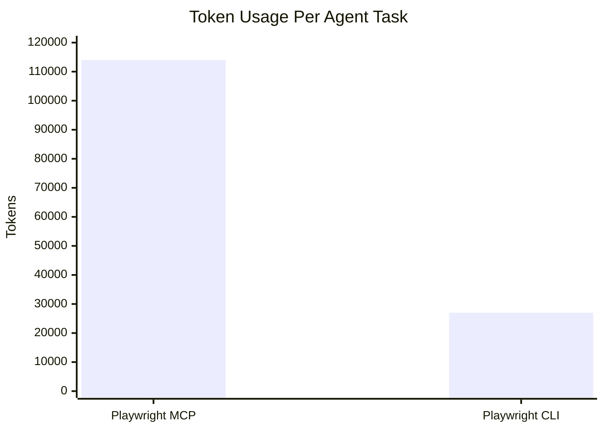
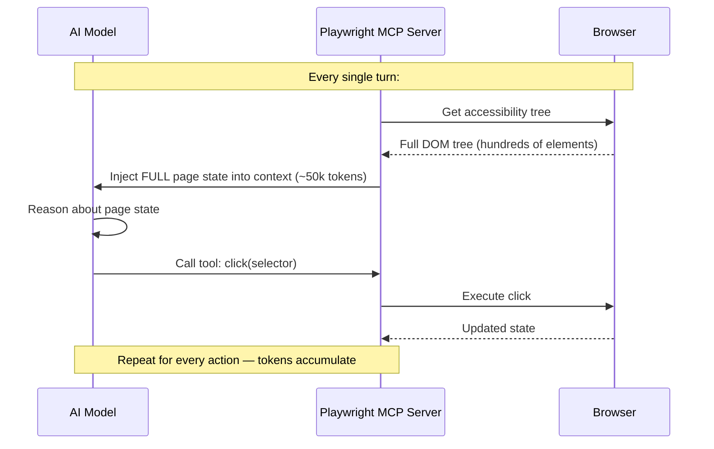
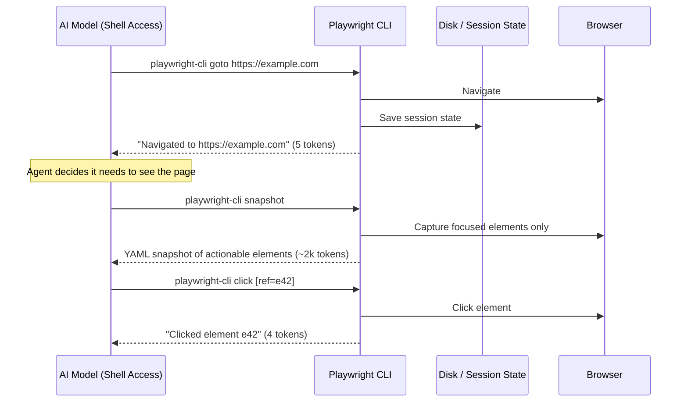
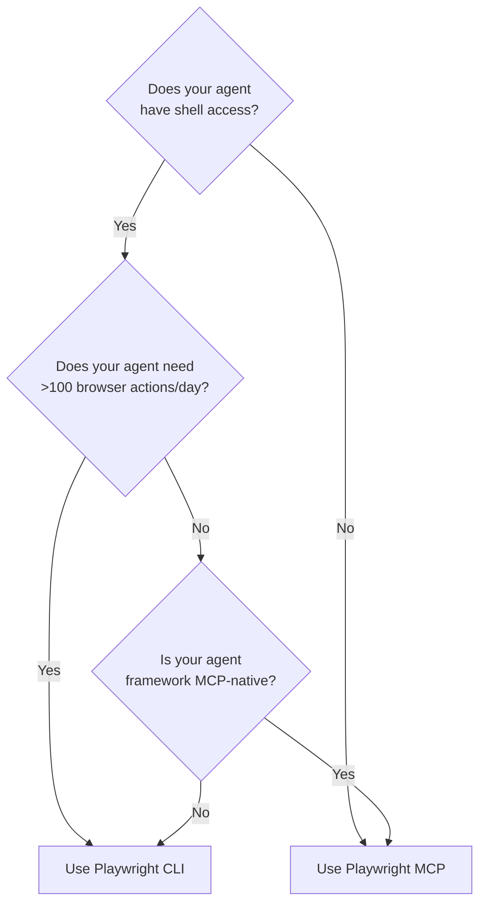

import Callout from '@site/src/components/Callout';

# Chapter 2: CLI vs MCP: Token-Efficient Browser Automation Architecture

## What You Will Learn

You will understand exactly how Playwright CLI and Playwright MCP differ architecturally and why that difference matters for token consumption. You will learn when to choose CLI versus MCP for your agent architecture. You will see the data-flow diagrams for both approaches and understand the "skills" pattern that makes CLI so efficient.

## Prerequisites

- Chapter 1: The Agentic Testing Revolution

---

## The Core Problem: Context Window Pressure

AI models have a finite context window. Every token consumed by browser state is a token unavailable for reasoning, planning, and code generation. When a web page has hundreds of interactive elements, streaming all of them to the model on every step is expensive.

Let's quantify the problem:



**114,000 tokens (MCP) vs 27,000 tokens (CLI)** for the same task. That's not a marginal improvement — it's a architectural difference.

---

## How Playwright MCP Works

Playwright MCP is a Model Context Protocol server. When an agent connects to it, the MCP server:

1. Controls a browser instance
2. On every agent turn: serializes the **entire accessibility tree** of the current page into JSON
3. Injects that JSON into the model's context window
4. The model reads the full page state, decides what to do, and calls a tool
5. The MCP server executes the tool, updates the browser, and repeats



The accessibility tree for a typical web page easily contains 500–2,000 elements. In JSON format, that's 30,000–80,000 tokens per turn.

### When MCP Is the Right Choice

MCP is better when:
- Your agent runs in a **sandboxed environment** without shell access (e.g., in a web-based IDE)
- You need **persistent connection** to a browser session across multiple agent turns
- Your agent framework is built around MCP protocol natively
- You need the full page structure for complex reasoning about page layout

---

## How Playwright CLI Works

Playwright CLI takes the opposite approach. Instead of pushing state to the model, it lets the model **pull only what it needs**.



Key differences:
- **Most commands return minimal output** (~2–10 tokens, e.g., "Navigated.")
- **The full page state is never injected** unless the agent explicitly calls `snapshot`
- **Even snapshots are filtered** — they show only actionable elements, not every DOM node
- **Browser session persists on disk** — the model doesn't carry it

### The YAML Snapshot: Just Enough Information

When the agent calls `playwright-cli snapshot`, it receives a structured YAML document that looks like this:

```yaml
- ref: e1
  role: navigation
  children:
    - ref: e2
      role: link
      name: "Home"
    - ref: e3
      role: link
      name: "Products"
- ref: e4
  role: main
  children:
    - ref: e5
      role: heading
      name: "Welcome to Our Store"
    - ref: e6
      role: button
      name: "Shop Now"
```

No layout information. No style information. No non-interactive elements. Just the elements an agent needs to take the next action. A typical snapshot for a complex page is 1,000–3,000 tokens — vs 30,000–80,000 for a full accessibility tree.

<Callout type="ai">
**For AI Engineers:** The snapshot format is agent-optimized. References like `e42` are stable within a session — you can `click [ref=e42]` without re-running `snapshot`. The agent can call `snapshot` once, extract all the refs it needs, and execute 5–10 actions before needing to re-read the page. This is the real source of token efficiency.
</Callout>

---

## Side-by-Side Architecture Comparison

| Dimension | Playwright MCP | Playwright CLI |
|---|---|---|
| **Protocol** | Model Context Protocol (JSON-RPC) | Shell commands (stdin/stdout) |
| **Page state delivery** | Full accessibility tree pushed every turn | Minimal YAML snapshot pulled on demand |
| **Tokens per task** | ~114,000 | ~27,000 |
| **Browser state location** | In model context | On disk (external) |
| **Agent requirement** | MCP-compatible client | Shell access |
| **Multi-session support** | One session per server | Multiple sessions via `-s=` flag |
| **Initialization time** | Server startup (~2s) | CLI command (~200ms) |
| **Offline capability** | No (protocol server required) | Yes (after install) |
| **Best for** | Sandboxed agent environments | Coding agents with shell access |

---

## The "Skills" Pattern Explained

Playwright CLI follows the **skills** pattern — a design philosophy for making tools agent-friendly:

```mermaid
flowchart TD
    subgraph Skills["Skill-Based CLI (Playwright CLI)"]
        S1["Simple shell commands\nplaywright-cli click e42"]
        S2["Minimal output\nClicked element e42"]
        S3["External state\nSession saved to disk"]
    end

    subgraph MCP["Protocol-Based (Playwright MCP)"]
        M1["JSON-RPC tool calls\n{\"method\": \"browser_click\", \"params\": {...}}"]
        M2["Heavy output\nFull accessibility tree in context"]
        M3["In-context state\nFull page state in every turn"]
    end

    Skills --> A["Token-efficient\n~27k tokens/task"]
    MCP --> B["Feature-rich\n~114k tokens/task"]
```

The skills approach trades feature richness for efficiency. For agents that need to complete high-volume tasks (testing hundreds of pages, auto-discovering features), that trade is almost always worth it.

<Callout type="dev">
**For Developers:** The skills pattern also makes Playwright CLI composable with other CLI tools. You can pipe `playwright-cli snapshot` output to `jq`, `grep`, or any text processor. It fits naturally into shell scripts and Makefiles alongside `curl`, `jq`, and standard Unix tools.
</Callout>

<Callout type="qa">
**For QA Engineers:** Think of it this way: MCP gives your agent a full-color, annotated map of every room in a building. CLI gives your agent a compass and a description of just the door in front of it. For navigating a specific route, the compass is faster. For exploring an unknown building, the map is better.
</Callout>

---

## Decision Framework: Which to Use?

Use this decision tree to choose the right tool:



**Choose Playwright CLI when:**
- Your agent runs in Claude Code, Cursor, GitHub Copilot, or any IDE with shell access
- You're doing high-volume tasks: discovery, test generation, tutorial creation
- Token cost is a constraint (API budget, rate limits)

**Choose Playwright MCP when:**
- Your agent runs in a web browser or sandboxed environment
- Your framework integrates with MCP natively (e.g., Claude Desktop)
- You need the richest possible page state for complex visual reasoning

---

## Try It Yourself

**Challenge 1:** Look at the token comparison table above. If your agent runs 500 tasks per day, how many tokens would you save by switching from MCP to CLI? (Hint: 114,000 - 27,000 = X tokens per task, × 500 tasks)

**Challenge 2:** Think about an agent workflow you'd like to build. Does it require shell access? Use the decision tree above to decide whether CLI or MCP is the right choice.

---

## Common Mistakes

**Mistake 1: Calling `snapshot` on every action**

Agents sometimes call `snapshot` before and after every action, eliminating the token efficiency advantage.

Fix: Call `snapshot` once at the start of a workflow segment. Reuse the element references (`e42`, `e15`) for all subsequent actions. Only re-snapshot when you expect the page to change significantly.

**Mistake 2: Assuming CLI replaces MCP in all cases**

CLI has no persistent streaming connection. If your agent architecture relies on server-sent events or real-time page change notifications, MCP is still the right tool.

**Mistake 3: Parsing snapshot YAML manually in application code**

The snapshot YAML is designed for AI model consumption, not for regex parsing. If you need structured data from a page, use Playwright's standard `page.evaluate()` or `page.locator()` APIs in a test file instead.

---

## Summary

- Playwright MCP streams full accessibility trees into model context (~114k tokens/task)
- Playwright CLI keeps browser state on disk and lets agents pull only what they need (~27k tokens/task)
- The YAML snapshot is the key abstraction — focused, agent-optimized, minimal
- The "skills" pattern makes CLI tools token-efficient and composable
- Use CLI when your agent has shell access and does high-volume tasks; use MCP for sandboxed agents

## Next Steps

Now that you understand the architecture, it's time to install Playwright CLI and run your first session.

**[→ Chapter 3: Installation, Setup, and Your First Playwright CLI Session](./chapter-03-installation-and-first-run)**
