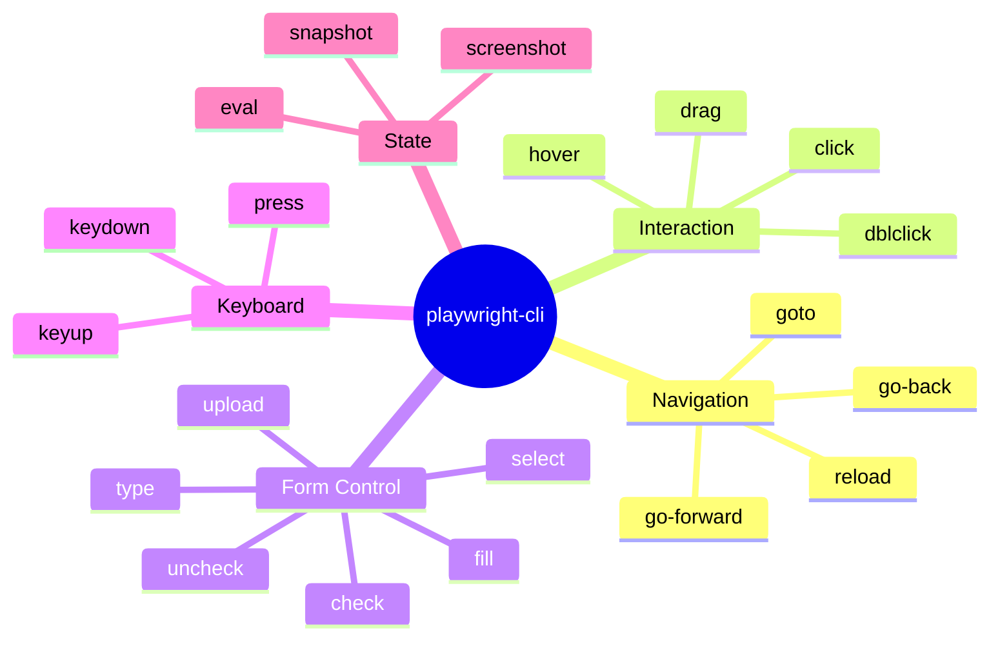

import Callout from '@site/src/components/Callout';
import TerminalPlayground from '@site/src/components/TerminalPlayground';

# Chapter 4: Core CLI Commands: Navigation, Interaction, and Page Control

## What You Will Learn

You will learn every core Playwright CLI command and understand when to use each. You will understand the YAML snapshot format deeply, including how to use element references efficiently. You will see each command in action via interactive terminal demos.

## Prerequisites

- Chapter 3: Installation, Setup, and Your First Session

---

## Command Categories

Playwright CLI commands fall into five categories:



---

## Navigation Commands

### `goto [url]`

Navigate to a URL. Waits for the page to reach "load" state.

```bash
playwright-cli goto https://example.com
playwright-cli goto https://example.com --wait-until=networkidle
```

Flags:
- `--wait-until=load|domcontentloaded|networkidle` — default: `load`
- `--timeout=30000` — navigation timeout in ms

### `go-back`, `go-forward`, `reload`

```bash
playwright-cli go-back
playwright-cli go-forward
playwright-cli reload
```

### `resize [width] [height]`

Set viewport size:

```bash
playwright-cli resize 1280 720
playwright-cli resize 375 812    # iPhone viewport
```

---

## Interaction Commands

### `click [selector|ref]`

Click any element. Accepts CSS selectors or snapshot refs:

```bash
playwright-cli click [ref=e42]          # Use snapshot ref (preferred)
playwright-cli click "button:has-text('Submit')"  # CSS selector
playwright-cli click "#submit-btn"      # ID selector
```

<Callout type="ai">
**For AI Engineers:** Snapshot refs (`[ref=e42]`) are the most reliable selector type. They're generated fresh each snapshot, so they're always accurate to the current page state. Use them over CSS selectors when possible.
</Callout>

### `dblclick [selector|ref]`

Double-click for table rows, file manager items, etc.:

```bash
playwright-cli dblclick [ref=e15]
```

### `hover [selector|ref]`

Hover to trigger tooltips, dropdowns, or CSS hover states:

```bash
playwright-cli hover [ref=e8]
```

### `drag [source] [target]`

Drag and drop:

```bash
playwright-cli drag [ref=e10] [ref=e25]
```

---

## Form Control Commands

### `fill [selector|ref] [value]`

Clear and fill an input field (fastest for programmatic input):

```bash
playwright-cli fill [ref=e5] "user@example.com"
playwright-cli fill "#search-input" "playwright cli tutorial"
```

### `type [selector|ref] [text]`

Type text character by character (simulates real keystrokes — use for inputs with key event handlers):

```bash
playwright-cli type [ref=e5] "user@example.com"
```

### `select [selector|ref] [value]`

Select a dropdown option by value, label, or index:

```bash
playwright-cli select [ref=e12] "California"        # By label
playwright-cli select "#country" "US"               # By value
```

### `check [selector|ref]`, `uncheck [selector|ref]`

Toggle checkboxes:

```bash
playwright-cli check [ref=e18]     # Check
playwright-cli uncheck [ref=e18]   # Uncheck
```

### `upload [selector|ref] [filepath]`

Upload a file:

```bash
playwright-cli upload [ref=e20] /path/to/document.pdf
```

---

## Keyboard Commands

### `press [key]`

Press a keyboard key or combination:

```bash
playwright-cli press "Enter"
playwright-cli press "Control+A"
playwright-cli press "Escape"
playwright-cli press "Tab"
playwright-cli press "ArrowDown"
```

Key names follow the [KeyboardEvent.key spec](https://developer.mozilla.org/en-US/docs/Web/API/UI_Events/Keyboard_event_key_values).

### `keydown [key]`, `keyup [key]`

Hold or release a key (for complex keyboard interactions):

```bash
playwright-cli keydown "Shift"
playwright-cli click [ref=e5]   # Shift+click
playwright-cli keyup "Shift"
```

---

## State Commands

### `snapshot`

The most important command. Returns a YAML document of actionable page elements:

```bash
playwright-cli snapshot
```

Full snapshot output for a login page:

```yaml
- ref: e1
  role: main
  children:
    - ref: e2
      role: heading
      name: "Sign in to your account"
    - ref: e3
      role: textbox
      name: "Email address"
      value: ""
    - ref: e4
      role: textbox
      name: "Password"
      value: ""
    - ref: e5
      role: checkbox
      name: "Remember me"
      checked: false
    - ref: e6
      role: button
      name: "Sign in"
    - ref: e7
      role: link
      name: "Forgot your password?"
```

Snapshot flags:
- `--format=yaml|json` — default: yaml
- `--element=[ref]` — snapshot only a subtree

<Callout type="dev">
**For Developers:** Notice the snapshot doesn't include styling, layout position, or non-interactive text. This is intentional. The model only needs to know what it can interact with. All decoration is stripped.
</Callout>

### `screenshot`

Capture the current page as PNG:

```bash
playwright-cli screenshot --path=page.png
playwright-cli screenshot --path=hero.png --clip=0,0,800,400   # Clip region
playwright-cli screenshot --path=full.png --full-page          # Full-page screenshot
```

### `eval [javascript]`

Execute JavaScript in the page context:

```bash
playwright-cli eval "document.title"
playwright-cli eval "window.location.href"
playwright-cli eval "document.querySelectorAll('a').length"
```

Returns the serialized result.

---

## Dialog Handling

### `dialog-accept [text]`, `dialog-dismiss`

Handle `alert()`, `confirm()`, and `prompt()` dialogs:

```bash
playwright-cli dialog-accept           # Accept alert/confirm
playwright-cli dialog-accept "My text" # Accept prompt with input
playwright-cli dialog-dismiss          # Dismiss confirm/prompt
```

Dialogs must be handled before the action that triggers them or immediately after.

---

## Interactive Terminal Demo

See these commands in action with real CLI output:

<TerminalPlayground chapter="chapter-04-core-cli-commands" />

---

## Putting It Together: A Complete Workflow

Here's a complete agent workflow — log in to an application and verify the dashboard:

```bash
# Navigate to login page
playwright-cli goto https://app.example.com/login

# Inspect what's on the page
playwright-cli snapshot

# Fill in credentials (using refs from snapshot output)
playwright-cli fill [ref=e3] "user@example.com"
playwright-cli fill [ref=e4] "secretpassword"
playwright-cli click [ref=e6]

# Wait for navigation and verify we're on dashboard
playwright-cli snapshot

# Take evidence screenshot
playwright-cli screenshot --path=login-success.png
```

<Callout type="qa">
**For QA Engineers:** Notice how this workflow reads like a manual test script. Each step is explicit and auditable. When an agent runs this, it produces the same `login-success.png` screenshot you'd capture during manual testing — but automatically, at scale.
</Callout>

---

## Try It Yourself

### Challenge 1: Login Automation
Using a test site like `https://the-internet.herokuapp.com/login`, write a sequence of Playwright CLI commands to:
1. Navigate to the login page
2. Take a snapshot to identify the username/password fields
3. Fill in `tomsmith` / `SuperSecretPassword!`
4. Click the login button
5. Take a screenshot of the result

### Challenge 2: Form Interaction
Navigate to `https://the-internet.herokuapp.com/checkboxes`. Use `snapshot` to find the checkboxes, then `check` and `uncheck` them. Use `eval "document.querySelectorAll('input:checked').length"` to verify the count.

### Challenge 3: Multi-Step Navigation
Navigate to `https://playwright.dev`, use `snapshot` to find the search icon, `click` it, `type` "test agents" in the search box, press `Enter`, and take a screenshot of the results.

---

## Common Mistakes

**Mistake 1: Using `type` when `fill` is sufficient**
```bash
# Slow — simulates every keystroke
playwright-cli type [ref=e3] "user@example.com"

# Fast — clears and sets value atomically
playwright-cli fill [ref=e3] "user@example.com"
```
Use `fill` for most inputs. Use `type` only when the input relies on `keydown`/`keypress` events (e.g., autocomplete with debounced search).

**Mistake 2: Hardcoding CSS selectors instead of snapshot refs**
```bash
# Fragile — breaks if class names change
playwright-cli click ".btn-primary.submit-button"

# Robust — always accurate to current snapshot
playwright-cli click [ref=e6]
```

**Mistake 3: Not handling dialogs before triggering them**
If a button triggers an `alert()`, the `click` command will hang. Call `dialog-accept` before `click`:
```bash
playwright-cli dialog-accept
playwright-cli click [ref=e8]   # This button triggers alert()
```

---

## Summary

- Navigation: `goto`, `go-back`, `go-forward`, `reload`, `resize`
- Interaction: `click`, `dblclick`, `hover`, `drag`
- Form control: `fill` (preferred), `type`, `select`, `check`, `uncheck`, `upload`
- Keyboard: `press`, `keydown`, `keyup`
- State: `snapshot` (YAML), `screenshot` (PNG), `eval` (JavaScript)
- Dialogs: `dialog-accept`, `dialog-dismiss`
- Snapshot refs (`[ref=eN]`) are more reliable than CSS selectors

## Next Steps

Now that you know all the commands, Chapter 5 goes deep on snapshot-based state management — the technique that makes token-efficient agent automation possible.

**[→ Chapter 5: Snapshot-Based State Management](./chapter-05-snapshot-state-management)**
