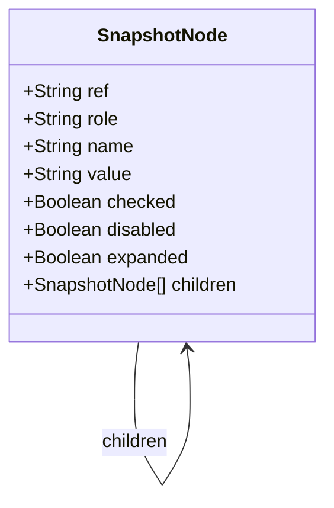
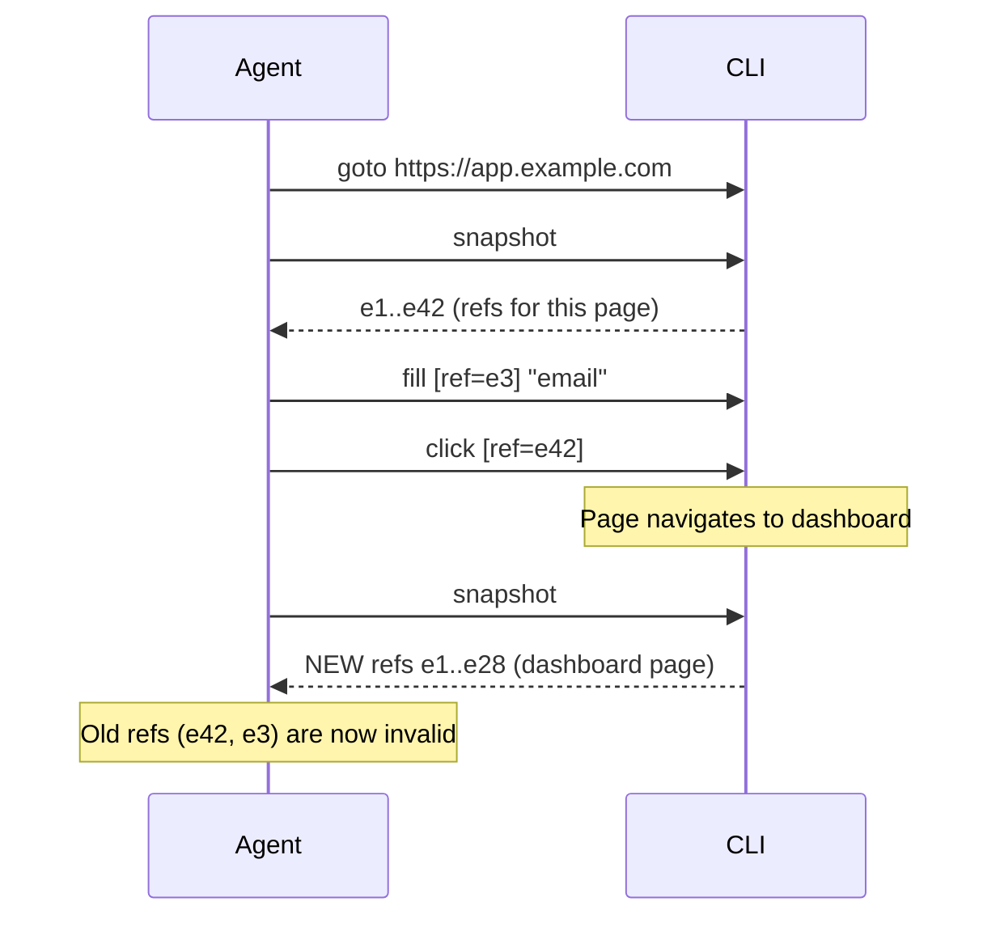

import Callout from '@site/src/components/Callout';
import TerminalPlayground from '@site/src/components/TerminalPlayground';

# Chapter 5: Snapshot-Based State Management: Reading the Browser Efficiently

## What You Will Learn

You will master the YAML snapshot format and understand how to use it for efficient agent state management. You will learn when to snapshot and when not to, how to use element references across multiple commands, and how to manage multiple browser sessions. By the end, you will write agent workflows that minimize token usage without losing accuracy.

## Prerequisites

- Chapter 4: Core CLI Commands

---

## Why State Management Matters for Agents

An AI agent's "state" is whatever is in its context window. Every byte counts. Poor state management causes:
- Token waste (unnecessary snapshots)
- Stale data errors (using refs from old snapshots)
- Context overflow (cramming too much page data into one turn)

Playwright CLI's snapshot system is designed to address all three. Understanding it deeply separates agents that are efficient from those that burn tokens unnecessarily.

---

## Anatomy of a YAML Snapshot



Every node in a snapshot has:

| Field | Meaning | Always Present? |
|---|---|---|
| `ref` | Stable element reference (`e1`, `e42`) | Yes |
| `role` | ARIA role (`button`, `textbox`, `link`, `heading`) | Yes |
| `name` | Accessible name (visible text or aria-label) | Usually |
| `value` | Current value for inputs | For inputs |
| `checked` | Checkbox/radio state | For checkboxes |
| `disabled` | Whether element is disabled | When true |
| `expanded` | Accordion/disclosure state | When applicable |
| `children` | Child elements | When present |

### What Is Excluded from Snapshots

The snapshot intentionally omits:
- Non-interactive text (paragraphs, spans, divs with no role)
- Styling information (colors, fonts, layout)
- Hidden elements (`display: none`, `visibility: hidden`)
- Decorative images (images without alt text)
- Script content

This filtering is what makes snapshots token-efficient.

---

## Ref Stability

Refs are stable within a page session. This is crucial for multi-step workflows:

```bash
# Take snapshot once
playwright-cli snapshot
# Output: e42 = submit button

# Use ref across multiple actions — no need to re-snapshot
playwright-cli fill [ref=e3] "user@example.com"
playwright-cli fill [ref=e4] "password123"
playwright-cli click [ref=e42]    # Still valid — ref hasn't changed
```

Refs become **invalid** when:
- The page navigates to a new URL
- A significant portion of the DOM re-renders (e.g., SPA route change)
- The element is removed from the DOM

After navigation, always call `snapshot` again before using refs.



<Callout type="ai">
**For AI Engineers:** A common agent pattern is to save the "submit" ref from the first snapshot, fill all fields using their refs, then click submit — all without a second snapshot. This is correct and efficient. Just remember to re-snapshot after any navigation.
</Callout>

---

## Selective Snapshotting

For large pages with hundreds of elements, snapshot a subtree instead of the full page:

```bash
# Full page snapshot (can be large)
playwright-cli snapshot

# Snapshot only the navigation area
playwright-cli snapshot --element=[ref=e1]

# Snapshot only a specific form
playwright-cli snapshot --element="#login-form"
```

Selective snapshotting can reduce snapshot size by 80–90% on complex pages. Use it when:
- You already know which area of the page you're working with
- The page has large tables, lists, or data grids
- You want to focus an agent's attention on a specific section

---

## Session Management with `-s`

The `-s` flag creates named sessions. Each session is a fully isolated browser context:

```bash
# Create two sessions
playwright-cli -s=checkout goto https://shop.example.com/cart
playwright-cli -s=comparison goto https://shop.example.com/products

# Operate them independently
playwright-cli -s=checkout snapshot
playwright-cli -s=comparison snapshot

# Each session has its own cookies, localStorage, viewport
```

### Session Patterns

**Pattern 1: Before/After Comparison**
```bash
playwright-cli -s=before goto https://staging.example.com
playwright-cli -s=before screenshot --path=before.png

# Deploy update...

playwright-cli -s=after goto https://staging.example.com
playwright-cli -s=after screenshot --path=after.png
```

**Pattern 2: Parallel User Flows**
```bash
# Simulate admin and regular user simultaneously
playwright-cli -s=admin goto https://app.example.com/admin
playwright-cli -s=user goto https://app.example.com/dashboard
```

**Pattern 3: Isolation Testing**
```bash
# Session A performs an action; Session B verifies the effect
playwright-cli -s=writer fill [ref=e5] "New article content"
playwright-cli -s=reader goto https://app.example.com/articles
playwright-cli -s=reader snapshot   # Should show the new article
```

<Callout type="qa">
**For QA Engineers:** Multi-session patterns are directly applicable to testing multi-user features. Testing a chat application? Use two sessions — one for each participant. Testing admin/user permissions? Run both sessions simultaneously and verify the correct elements are visible or hidden in each.
</Callout>

---

## Interactive Terminal Demo

<TerminalPlayground chapter="chapter-05-snapshot-state-management" />

---

## Token-Efficient State Management Patterns

### Pattern 1: Snapshot Once, Act Many

```bash
playwright-cli goto https://app.example.com/form
playwright-cli snapshot    # ONE snapshot

# Fill all fields without re-snapshotting
playwright-cli fill [ref=e3] "First Name"
playwright-cli fill [ref=e4] "Last Name"
playwright-cli fill [ref=e5] "user@email.com"
playwright-cli select [ref=e6] "United States"
playwright-cli check [ref=e7]

playwright-cli click [ref=e8]    # Submit
playwright-cli snapshot          # Re-snapshot AFTER navigation
```

**Tokens saved:** 1 snapshot instead of 8.

### Pattern 2: Navigate, Snapshot, Extract All Refs

For agent workflows, extract all needed refs in one snapshot, then batch-process them:

```bash
playwright-cli goto https://shop.example.com/products
playwright-cli snapshot
# Agent extracts: product links [ref=e12, e15, e18, e21, ...]

# Process each without re-snapshotting the list page
playwright-cli -s=p1 goto [url of product 1]
playwright-cli -s=p2 goto [url of product 2]
playwright-cli -s=p1 snapshot
playwright-cli -s=p2 snapshot
```

### Pattern 3: Use `eval` for Quick State Checks

For simple state checks, `eval` is faster than `snapshot`:

```bash
# Check if user is logged in (no snapshot needed)
playwright-cli eval "!!document.querySelector('[data-user-logged-in]')"

# Get current URL
playwright-cli eval "window.location.href"

# Count items in cart
playwright-cli eval "document.querySelectorAll('.cart-item').length"
```

---

## Try It Yourself

### Challenge 1: Ref Lifetime
Navigate to any multi-page website. Take a snapshot. Note three ref numbers. Navigate to a second page. Try using one of the old refs in a `click` command. Observe what happens. Now take a new snapshot and use the new refs.

### Challenge 2: Selective Snapshot
Navigate to `https://news.ycombinator.com`. Take a full snapshot and count the elements. Then take a selective snapshot of just the navigation using `--element="header"`. Compare the sizes.

### Challenge 3: Three-Session Workflow
Create three sessions: one logged-in user, one guest, one admin (use any demo site that supports multiple roles). Take snapshots from each session and compare what elements are visible in each.

---

## Common Mistakes

**Mistake 1: Re-snapshotting after every action**
```bash
playwright-cli goto url
playwright-cli snapshot          # OK
playwright-cli fill [ref=e3] "x"
playwright-cli snapshot          # Unnecessary! Fill doesn't change the DOM
playwright-cli fill [ref=e4] "y"
playwright-cli snapshot          # Still unnecessary
playwright-cli click [ref=e6]
playwright-cli snapshot          # This is appropriate — click may navigate
```

Only re-snapshot after `click`, `press Enter`, `go-back`, `go-forward`, or `reload`.

**Mistake 2: Using stale refs after navigation**
```bash
playwright-cli goto url1
playwright-cli snapshot          # Gets e42 = submit button
playwright-cli click [ref=e42]   # Navigates to url2
playwright-cli click [ref=e42]   # ERROR — e42 no longer exists!
```

**Mistake 3: Snapping the full page when only a form is needed**
```bash
# On a page with 200+ elements:
playwright-cli snapshot     # Returns huge YAML with nav, footer, modals...

# Better:
playwright-cli snapshot --element="#registration-form"   # Only the form
```

---

## Summary

- Snapshot YAML contains `ref`, `role`, `name`, `value`, `checked`, `disabled` for each actionable element
- Refs are stable within a page — invalid after navigation or significant DOM re-render
- Take one snapshot, use refs for all actions, re-snapshot only after navigation
- Use `--element=[ref]` for selective subtree snapshots on complex pages
- Named sessions with `-s=name` provide isolated browser contexts for parallel workflows
- `eval` is more token-efficient than `snapshot` for simple state checks

## Next Steps

Chapter 6 shows how to wire Playwright CLI into real AI coding agents — Claude Code, GitHub Copilot, Cursor, and custom agents.

**[→ Chapter 6: Connecting AI Agents to Playwright CLI](./chapter-06-connecting-ai-agents)**
