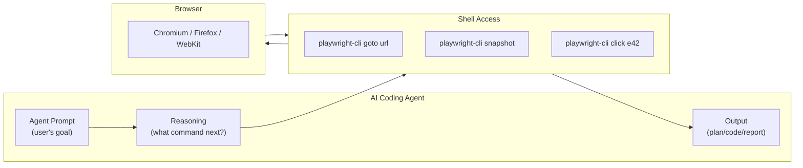

import Callout from '@site/src/components/Callout';
import CodePlayground from '@site/src/components/CodePlayground';

# Chapter 6: Connecting AI Agents to Playwright CLI: Claude, Copilot, and Custom Agents

## What You Will Learn

You will learn how to connect real AI coding agents to Playwright CLI. You will configure Claude Code, GitHub Copilot, and Cursor to use Playwright CLI as a browser tool. You will also learn how to build a custom agent integration using the Playwright CLI skill definition. By the end, your agent will autonomously navigate, inspect, and interact with any website.

## Prerequisites

- Chapter 5: Snapshot-Based State Management
- At least one AI coding agent installed (Claude Code, Copilot, or Cursor)

---

## The Integration Model

Every AI coding agent that supports shell tools can use Playwright CLI. The integration is conceptually simple:



The agent reads the skill definition (which describes what commands are available), then decides which commands to run based on the user's goal.

---

## The Playwright CLI Skill Definition

The official Playwright CLI skill is published at [`playbooks.com/skills/microsoft/playwright-cli`](https://playbooks.com/skills/microsoft/playwright-cli/playwright-cli).

For Claude Code and Codex, create a skill file at `.codex/skills/playwright-cli/SKILL.md`. Here's the essential version:

```markdown
---
name: playwright-cli
description: Control a web browser using Playwright CLI for navigation, interaction, testing, and screenshot capture. Use this skill for any task that requires browsing websites, filling forms, clicking buttons, capturing screenshots, or automating browser workflows. Triggers on: "open browser", "navigate to", "click on website", "take screenshot of", "test the website", "fill form".
---

## Available Commands

Navigate: `playwright-cli goto [url]`
Inspect: `playwright-cli snapshot` → returns YAML of interactive elements with refs
Click: `playwright-cli click [ref=eN]`
Fill: `playwright-cli fill [ref=eN] [value]`
Type: `playwright-cli type [ref=eN] [text]`
Screenshot: `playwright-cli screenshot --path=[filename].png`
Select: `playwright-cli select [ref=eN] [option]`
Check/Uncheck: `playwright-cli check [ref=eN]` / `playwright-cli uncheck [ref=eN]`
Press key: `playwright-cli press [Key]`
Execute JS: `playwright-cli eval "[javascript]"`
Multi-session: add `-s=[name]` flag to any command

## Workflow

1. `goto` the URL
2. `snapshot` to see interactive elements
3. Use refs from snapshot for interactions
4. Re-`snapshot` after navigation
5. `screenshot` to capture evidence
```

---

## Claude Code Integration

Claude Code automatically picks up skills from `~/.codex/skills/`. Once the Playwright CLI skill is installed, you can ask:

> "Open playwright.dev, find the 'Get started' button, click it, and take a screenshot."

Claude Code will:
1. Recognize the task requires browser control
2. Load the Playwright CLI skill
3. Run the commands autonomously

### Installation for Claude Code

```bash
# Create skill directory
mkdir -p ~/.codex/skills/playwright-cli

# Create SKILL.md with the skill definition shown above
# (copy from playbooks.com or use the skill installer)
```

### Example Claude Code Session

The interactive demo below shows how to configure a Claude Code SKILL.md for Playwright CLI integration:

<CodePlayground chapter="chapter-06-connecting-ai-agents" />

<Callout type="ai">
**For AI Engineers:** Claude Code's skill system is the same format as the `interactive-book-generator` skill we used to build this book. The `SKILL.md` with YAML frontmatter is the agent's entry point. The `description` field determines when the skill is loaded — so make it trigger-rich and specific.
</Callout>

---

## GitHub Copilot Integration

GitHub Copilot in VS Code supports tool extensions. Configure Playwright CLI as a tool in your `.vscode/mcp.json`:

```json
{
  "tools": [
    {
      "name": "playwright-cli",
      "type": "shell",
      "command": "playwright-cli",
      "description": "Control a browser. Commands: goto [url], snapshot, click [ref=eN], fill [ref=eN] [value], screenshot --path=[file]"
    }
  ]
}
```

In the Copilot chat, ask: `@workspace Use playwright-cli to navigate to https://example.com and take a screenshot.`

---

## Cursor Integration

Cursor supports custom AI tools via `.cursor/tools.json`:

```json
{
  "playwright": {
    "command": "playwright-cli",
    "description": "Browser automation. goto [url] to navigate. snapshot to inspect elements. click/fill/type to interact. screenshot to capture.",
    "when": "user mentions browsing, clicking, form filling, website testing, screenshot"
  }
}
```

---

## Custom Agent Integration (Node.js)

For agents you build yourself, integrate via Node.js `child_process`:

```typescript
import { execSync } from 'child_process';

class PlaywrightCLIAgent {
  private session: string;

  constructor(sessionName = 'default') {
    this.session = sessionName;
  }

  private run(command: string): string {
    return execSync(`playwright-cli -s=${this.session} ${command}`, {
      encoding: 'utf-8',
      timeout: 30000,
    }).trim();
  }

  goto(url: string): string {
    return this.run(`goto ${url}`);
  }

  snapshot(): string {
    return this.run('snapshot');
  }

  click(ref: string): string {
    return this.run(`click [ref=${ref}]`);
  }

  fill(ref: string, value: string): string {
    return this.run(`fill [ref=${ref}] "${value}"`);
  }

  screenshot(path: string): string {
    return this.run(`screenshot --path=${path}`);
  }

  eval(js: string): string {
    return this.run(`eval "${js}"`);
  }
}

// Usage
const browser = new PlaywrightCLIAgent('my-session');
browser.goto('https://example.com');
const snapshot = browser.snapshot();
console.log(snapshot);
```

<Callout type="dev">
**For Developers:** This TypeScript wrapper is the foundation for any custom agent integration. You can extend it to parse snapshot YAML, extract specific refs automatically, retry on failure, or integrate with your observability stack (logging, tracing).
</Callout>

---

## Agent Prompt Engineering for Playwright CLI

The quality of your agent's browser automation depends heavily on how you prompt it. Here are proven patterns:

### Pattern 1: Goal + Evidence

```
Navigate to https://app.example.com/checkout.
Complete the checkout form with test data (name: "Test User", email: "test@example.com", card: "4242 4242 4242 4242").
Take a screenshot when the order confirmation page appears.
```

### Pattern 2: Discovery + Report

```
Navigate to https://example.com.
Use snapshot to identify all the main navigation links.
Click each one and take a screenshot of each page.
Return a summary of what each page contains.
```

### Pattern 3: Verify + Assert

```
Navigate to https://staging.app.example.com.
Log in with admin@example.com / password123.
Verify that the user list shows at least 5 users.
Take a screenshot of the user list.
```

<Callout type="qa">
**For QA Engineers:** "Verify + Assert" prompts are the most directly useful for QA. The agent becomes your manual tester — executing steps and capturing evidence, just like a human tester would document their session.
</Callout>

---

## Try It Yourself

### Challenge 1: Claude Code Session
Install the Playwright CLI skill in Claude Code. Ask it: "Go to news.ycombinator.com and tell me the title of the top 3 stories." Observe how it uses `goto`, `snapshot`, and reads the refs.

### Challenge 2: Custom Agent Wrapper
Use the TypeScript `PlaywrightCLIAgent` class above. Write a function `getPageTitle(url: string): string` that navigates to a URL and returns `playwright-cli eval "document.title"`.

### Challenge 3: Multi-Agent Session
Configure two named sessions in your custom agent. Navigate one to a product listing page, the other to the product detail page of the first item. Compare the snapshot output between them.

---

## Common Mistakes

**Mistake 1: No skill description — agent never activates**
If the skill's `description` doesn't mention the trigger words in the user's message, the skill never loads. Make the description verbose about when to use it.

**Mistake 2: Agent uses `playwright test` instead of `playwright-cli`**
Make the skill description explicitly say: "Use `playwright-cli`, NOT `playwright test` or `npx playwright`."

**Mistake 3: Missing error handling in custom wrappers**
```typescript
// Will crash if playwright-cli isn't installed
const result = execSync('playwright-cli goto ...', { encoding: 'utf-8' });

// Safer
try {
  const result = execSync('playwright-cli goto ...', { encoding: 'utf-8', stdio: ['pipe', 'pipe', 'pipe'] });
} catch (error) {
  console.error('playwright-cli error:', (error as any).stderr?.toString());
}
```

---

## Summary

- Any AI coding agent with shell access can use Playwright CLI
- Install the skill definition at `~/.codex/skills/playwright-cli/SKILL.md`
- Claude Code, Copilot, and Cursor all support the skill pattern
- Build custom wrappers using Node.js `execSync` for programmatic control
- Prompt engineering: be specific about URLs, use "goal + evidence" pattern

## Next Steps

Chapter 7 introduces the three specialized Playwright Agents — Planner, Generator, and Healer — and shows how they work together to create and maintain test suites autonomously.

**[→ Chapter 7: The Three Playwright Agents: Planner, Generator, and Healer](./chapter-07-playwright-agents-planner-generator-healer)**
