import Callout from '@site/src/components/Callout';
import AgentPlayground from '@site/src/components/AgentPlayground';

# Chapter 7: The Three Playwright Agents: Planner, Generator, and Healer

## What You Will Learn

You will learn how to use Playwright's three built-in AI agents — Planner, Generator, and Healer — to autonomously create and maintain test suites. You will see a complete workflow from a user story to a running, self-healing test suite. By the end, you will be able to generate a full Playwright test suite for any application with minimal manual effort.

## Prerequisites

- Chapter 6: Connecting AI Agents to Playwright CLI
- A running web application to test (local or staging)

---

## Overview: The Autonomous Test Pipeline

The three Playwright Agents form a pipeline. Each agent hands off to the next:

```mermaid
flowchart LR
    Input["📋 User story or\nPRD description"] --> Planner

    subgraph Planner["🗓 Planner Agent"]
        P1["Reads goal"]
        P2["Identifies test scenarios"]
        P3["Produces structured\nMarkdown test plan"]
    end

    subgraph Generator["⚙️ Generator Agent"]
        G1["Reads test plan"]
        G2["Verifies selectors\nagainst live app"]
        G3["Generates TypeScript\nPlaywright tests"]
    end

    subgraph Healer["🔧 Healer Agent"]
        H1["Runs tests"]
        H2["Detects failures"]
        H3["Auto-fixes selectors\nand timing issues"]
    end

    Output["✅ Stable, running\ntest suite"]

    Planner --> Generator
    Generator --> Healer
    Healer --> Output
    Healer --> Generator
```



---

## The Planner Agent

The Planner takes a **goal description** — a user story, a PRD section, or plain English — and produces a structured Markdown test plan.

### Input Format

```
Given the application at https://staging.app.example.com, create a comprehensive test plan for the user registration flow. Users should be able to register with email/password, verify their email, and complete their profile. The app requires users to be 18+.
```

### Output: Structured Test Plan

```markdown
# Test Plan: User Registration Flow

## Scenarios

### 1. Successful Registration
- Navigate to /register
- Fill: email (valid format), password (8+ chars, 1 uppercase, 1 number)
- Click "Create Account"
- Assert: redirect to /verify-email page
- Assert: success message contains user's email address

### 2. Duplicate Email
- Attempt registration with existing account email
- Assert: error message "An account with this email already exists"
- Assert: form remains visible (no redirect)

### 3. Age Validation
- Fill: date_of_birth = today - 17 years
- Click "Create Account"
- Assert: error "You must be 18 or older to register"

### 4. Password Strength Validation
- Fill: password = "weak"
- Assert: strength indicator shows "Weak"
- Assert: submit button is disabled
- Fill: password = "StrongPass1"
- Assert: strength indicator shows "Strong"
- Assert: submit button is enabled

### 5. Email Verification Flow
- Complete successful registration
- Assert: verification email UI appears
- Click "Resend verification email"
- Assert: success message appears
```

<Callout type="qa">
**For QA Engineers:** The Planner's output is a test plan document — the same artifact you'd produce in a test planning session. The difference: the Planner generates it in seconds, covers more edge cases than a human might think of, and feeds directly into automated test generation.
</Callout>

### Running the Planner Agent

```typescript
import { test } from '@playwright/test';

test('generate test plan', async ({ page }) => {
  await page.goto('https://staging.app.example.com');

  const plan = await page.evaluate(async () => {
    const { PlannerAgent } = await import('@playwright/test/agents');
    const planner = new PlannerAgent();
    return planner.plan(`
      Create a test plan for the user registration flow.
      Registration requires email, password, date of birth.
      Users must be 18+.
    `);
  });

  // Save the plan to disk
  require('fs').writeFileSync('test-plan.md', plan);
});
```

Or via the Playwright CLI UI:

```bash
npx playwright test --agent=planner --goal="Test the checkout flow" --output=test-plan.md
```

---

## The Generator Agent

The Generator reads the Planner's Markdown output and produces **executable TypeScript Playwright tests**. It verifies selectors against the live application during generation, so it produces accurate, working tests (not theoretical ones).

### Input: Test Plan (from Planner)

The Generator reads `test-plan.md` (produced by the Planner).

### Output: TypeScript Test File

```typescript
import { test, expect } from '@playwright/test';

test.describe('User Registration Flow', () => {
  test.beforeEach(async ({ page }) => {
    await page.goto('/register');
  });

  test('Successful registration', async ({ page }) => {
    await page.getByLabel('Email address').fill('newuser@example.com');
    await page.getByLabel('Password').fill('SecurePass1!');
    await page.getByLabel('Date of birth').fill('1990-01-15');
    await page.getByRole('button', { name: 'Create Account' }).click();

    await expect(page).toHaveURL('/verify-email');
    await expect(page.getByText('newuser@example.com')).toBeVisible();
  });

  test('Duplicate email shows error', async ({ page }) => {
    await page.getByLabel('Email address').fill('existing@example.com');
    await page.getByLabel('Password').fill('SecurePass1!');
    await page.getByRole('button', { name: 'Create Account' }).click();

    await expect(
      page.getByText('An account with this email already exists')
    ).toBeVisible();
    await expect(page).toHaveURL('/register');
  });

  test('Under-18 age validation', async ({ page }) => {
    const under18Date = new Date();
    under18Date.setFullYear(under18Date.getFullYear() - 17);
    const dateStr = under18Date.toISOString().split('T')[0];

    await page.getByLabel('Email address').fill('young@example.com');
    await page.getByLabel('Password').fill('SecurePass1!');
    await page.getByLabel('Date of birth').fill(dateStr);
    await page.getByRole('button', { name: 'Create Account' }).click();

    await expect(
      page.getByText('You must be 18 or older to register')
    ).toBeVisible();
  });
});
```

### Running the Generator Agent

```bash
npx playwright test --agent=generator --plan=test-plan.md --output=tests/registration.spec.ts
```

<Callout type="dev">
**For Developers:** The Generator uses Playwright's `getByLabel`, `getByRole`, and `getByText` locators — not brittle CSS selectors. These locators are accessible and resilient to UI changes. The Generator's selector verification step ensures they work against the live application at generation time.
</Callout>

---

## The Healer Agent

The Healer runs your test suite, identifies failures, and automatically fixes them. It handles:
- Broken selectors (element names/labels changed)
- Timing issues (timeouts, race conditions)
- URL changes (routes were renamed)
- Assertion failures (expected text changed)

### Running the Healer

```bash
npx playwright test --agent=healer tests/registration.spec.ts
```

The Healer:
1. Runs all tests in the file
2. For each failure, inspects the live page at the point of failure
3. Identifies why the test failed (selector mismatch, timeout, wrong URL, etc.)
4. Generates a fix
5. Verifies the fix passes
6. Writes the updated test file

### Example Healer Output

```
🔧 Healer Agent — Registration Tests

Running 5 tests...

✅ Successful registration — PASSED
❌ Duplicate email shows error — FAILED

  Analyzing failure...
  Page at failure: /register
  Expected selector: page.getByText('An account with this email already exists')
  Actual text found: 'Email already in use. Please try a different email.'

  Fix: Update assertion text
  - await expect(page.getByText('An account with this email already exists')).toBeVisible();
  + await expect(page.getByText('Email already in use. Please try a different email.')).toBeVisible();

  Verifying fix... ✅ PASSED

✅ Under-18 age validation — PASSED
✅ Password strength validation — PASSED
✅ Email verification flow — PASSED

Tests healed: 1
Tests passing: 5/5
Updated file: tests/registration.spec.ts
```

<Callout type="qa">
**For QA Engineers:** The Healer is the maintenance automation you've always wanted. When a developer renames a button from "Submit" to "Create Account", instead of filing a test failure ticket and waiting for someone to fix it, the Healer detects and fixes it automatically. Test maintenance time drops by 60–70%.
</Callout>

---

## Interactive Agent Demo

<AgentPlayground chapter="chapter-07-playwright-agents-planner-generator-healer" />

---

## Complete Pipeline: User Story to Running Tests

```bash
# Step 1: Generate test plan from user story
npx playwright test --agent=planner \
  --goal="Test the shopping cart: add items, update quantities, remove items, checkout" \
  --output=test-plan.md

# Step 2: Generate TypeScript tests from plan
npx playwright test --agent=generator \
  --plan=test-plan.md \
  --url=https://staging.shop.example.com \
  --output=tests/cart.spec.ts

# Step 3: Run tests and heal any failures
npx playwright test --agent=healer tests/cart.spec.ts

# Step 4: Run final verified suite
npx playwright test tests/cart.spec.ts
```

Total time from user story to verified, running test suite: typically **5–15 minutes** for most flows.

---

## Try It Yourself

### Challenge 1: Planner
Write a goal description for a password reset flow (forgot password → email link → reset form → success). Run it through the Planner concept and sketch what the output test plan would look like.

### Challenge 2: Generator Output
Using the test plan you sketched in Challenge 1, sketch what the Generator would produce. What TypeScript locators would it use for each step? What assertions?

### Challenge 3: Healer Simulation
Take any existing Playwright test in your codebase. Change one selector string (e.g., rename a `getByRole` button name slightly). Run the test and observe the failure. Manually apply the Healer's logic: find the actual text in the browser and update the assertion.

---

## Common Mistakes

**Mistake 1: Vague Planner goals**
```
# Too vague — Planner produces generic scenarios
--goal="Test the website"

# Specific — Planner produces accurate, app-specific scenarios
--goal="Test the user registration flow at /register. Users must provide email, password (8+ chars), and date of birth. Users must be 18+."
```

**Mistake 2: Running Generator against a non-running app**
```bash
# Fails — Generator verifies selectors against live app
npx playwright test --agent=generator --plan=plan.md --url=https://app-that-is-down.com
```
Always verify your app is running and accessible before invoking the Generator.

**Mistake 3: Not running the Healer after UI changes**
The Healer is most valuable during active development when UI changes frequently. Add it to your CI pipeline: run Healer before the test run, not just after failures.

---

## Summary

- Three agents form an autonomous pipeline: Planner → Generator → Healer
- Planner converts goal descriptions into structured Markdown test plans
- Generator converts plans into TypeScript Playwright tests, verifying selectors against the live app
- Healer runs tests, identifies failures, auto-fixes them, and verifies the fixes
- The full pipeline goes from user story to verified, running tests in 5–15 minutes
- Healer reduces test maintenance time by 60–70%

## Next Steps

Chapter 8 covers one of the most powerful use cases: autonomous website discovery — teaching an agent to map all the features and functionality of any website.

**[→ Chapter 8: Autonomous Website Discovery: Mapping Features and Flows](./chapter-08-autonomous-website-discovery)**
