import Callout from '@site/src/components/Callout';
import TerminalPlayground from '@site/src/components/TerminalPlayground';

# Chapter 8: Autonomous Website Discovery: Mapping Features and Flows

## What You Will Learn

You will learn how to build an autonomous discovery agent that maps any website's features, navigation structure, and interactive flows — without any prior knowledge of the site. You will implement a crawler that produces a structured feature inventory, sitemap, and interaction catalog. By the end, you will have a reusable discovery tool applicable to any web application.

## Prerequisites

- Chapter 7: The Three Playwright Agents

---

## What Is Autonomous Discovery?

Traditional test planning requires a human who knows the application. They write test plans based on functional specs or prior knowledge. When testing an unfamiliar application — a competitor's product, a third-party tool, an acquired company's system — that knowledge doesn't exist.

Autonomous discovery solves this by:

```mermaid
flowchart TD
    Start["Start URL\nhttps://target-app.com"] --> Discover

    subgraph Discover["Discovery Phase"]
        Nav["Extract navigation\nlinks from snapshot"]
        Pages["Visit each page"]
        Features["Identify interactive\nfeatures on each page"]
        Forms["Map form inputs\nand submit flows"]
        Actions["Catalog buttons,\nmodals, dynamic content"]
    end

    Nav --> Pages --> Features --> Forms --> Actions

    Actions --> Inventory["📋 Feature Inventory\nJSON / Markdown report"]
    Actions --> Sitemap["🗺 Interactive Sitemap\nwith interaction points"]
    Actions --> TestBase["🧪 Test Generation Input\nfor Planner Agent"]
```



---

## Building the Discovery Agent

### Phase 1: Sitemap Construction

Start with the navigation. Crawl all internal links reachable from the homepage:

```typescript
import { execSync } from 'child_process';
import * as yaml from 'js-yaml';

interface SnapshotNode {
  ref: string;
  role: string;
  name?: string;
  href?: string;
  children?: SnapshotNode[];
}

function cli(cmd: string, session = 'discovery'): string {
  try {
    return execSync(`playwright-cli -s=${session} ${cmd}`, {
      encoding: 'utf-8', timeout: 30000,
    }).trim();
  } catch (e: any) {
    return e.stderr?.toString() ?? 'ERROR';
  }
}

function extractLinks(snapshotYaml: string): string[] {
  const nodes = yaml.load(snapshotYaml) as SnapshotNode[];
  const links: string[] = [];

  function traverse(nodes: SnapshotNode[]) {
    for (const node of nodes) {
      if (node.role === 'link' && node.name) {
        links.push(node.name);
      }
      if (node.children) traverse(node.children);
    }
  }

  if (Array.isArray(nodes)) traverse(nodes);
  return links;
}

async function buildSitemap(startUrl: string): Promise<string[]> {
  const visited = new Set<string>();
  const queue = [startUrl];
  const pages: string[] = [];

  while (queue.length > 0) {
    const url = queue.shift()!;
    if (visited.has(url)) continue;
    visited.add(url);

    cli(`goto ${url}`);
    const snapshot = cli('snapshot');
    const links = extractLinks(snapshot);

    pages.push(url);
    // Add internal links to queue (simplified — add URL resolution in production)
    console.log(`Discovered ${links.length} links on ${url}`);
  }

  return pages;
}
```

### Phase 2: Feature Extraction Per Page

For each page, identify what kinds of features exist:

```typescript
interface PageFeatures {
  url: string;
  title: string;
  forms: FormFeature[];
  buttons: string[];
  navigation: string[];
  dataDisplays: string[];
}

interface FormFeature {
  inputs: string[];
  submitLabel: string;
}

function extractPageFeatures(url: string): PageFeatures {
  cli(`goto ${url}`);
  const snapshotYaml = cli('snapshot');
  const title = cli('eval "document.title"');
  const nodes = yaml.load(snapshotYaml) as SnapshotNode[];

  const features: PageFeatures = {
    url,
    title,
    forms: [],
    buttons: [],
    navigation: [],
    dataDisplays: [],
  };

  function traverse(nodes: SnapshotNode[]) {
    for (const node of nodes) {
      if (node.role === 'button') features.buttons.push(node.name ?? 'unnamed');
      if (node.role === 'link') features.navigation.push(node.name ?? 'unnamed');
      if (node.role === 'textbox' || node.role === 'combobox') {
        features.forms.push({ inputs: [node.name ?? 'unnamed'], submitLabel: '' });
      }
      if (node.role === 'table' || node.role === 'list') {
        features.dataDisplays.push(node.name ?? node.role);
      }
      if (node.children) traverse(node.children);
    }
  }

  if (Array.isArray(nodes)) traverse(nodes);
  return features;
}
```

---

## Interactive Terminal Demo

<TerminalPlayground chapter="chapter-08-autonomous-website-discovery" />

---

## The Discovery Report

After crawling, produce a structured report:

```typescript
interface DiscoveryReport {
  targetUrl: string;
  discoveredAt: string;
  totalPages: number;
  pages: PageFeatures[];
  summary: {
    totalForms: number;
    totalButtons: number;
    totalNavigationLinks: number;
    uniqueFeatureTypes: string[];
  };
}

function generateReport(pages: PageFeatures[]): DiscoveryReport {
  return {
    targetUrl: pages[0]?.url ?? '',
    discoveredAt: new Date().toISOString(),
    totalPages: pages.length,
    pages,
    summary: {
      totalForms: pages.reduce((n, p) => n + p.forms.length, 0),
      totalButtons: pages.reduce((n, p) => n + p.buttons.length, 0),
      totalNavigationLinks: pages.reduce((n, p) => n + p.navigation.length, 0),
      uniqueFeatureTypes: [...new Set(pages.flatMap(p => p.dataDisplays))],
    },
  };
}
```

### Example Report Output (Markdown)

```markdown
# Discovery Report: https://shop.example.com
Generated: 2026-02-22T10:30:00Z

## Summary
- Pages discovered: 12
- Total forms: 4 (Search, Login, Registration, Checkout)
- Total interactive buttons: 47
- Data displays: Product grid, Cart table, Order history list

## Pages

### / (Homepage)
- Navigation: Home, Products, Cart (3 items), Account, Help
- Buttons: "Shop Now", "View Sale", "Browse Categories"
- No forms

### /products
- Navigation: Filter by category (6 links), Sort controls
- Buttons: "Add to Cart" (per product), "Quick View"
- Data: Product grid (24 items)

### /cart
- Forms: Quantity update, Coupon code
- Buttons: "Update Cart", "Proceed to Checkout", "Remove item" (per item)
- Data: Cart items table

### /checkout
- Forms: Shipping (5 fields), Payment (4 fields)
- Buttons: "Place Order", "Back to Cart"
```

<Callout type="qa">
**For QA Engineers:** This report is your test planning input. Every form in the report becomes a set of test scenarios. Every button becomes a test case. The discovery agent produces in 5 minutes what takes a QA analyst hours to manually document.
</Callout>

<Callout type="ai">
**For AI Engineers:** Feed this report directly to the Planner Agent: `--goal="Based on this discovery report: [report content], create a comprehensive test plan."` The Planner will produce test scenarios for every feature the discovery agent found.
</Callout>

---

## Complete Discovery Pipeline

```typescript
async function discoverWebsite(startUrl: string): Promise<void> {
  console.log(`🔍 Starting discovery: ${startUrl}`);

  // Phase 1: Get top-level navigation
  cli(`goto ${startUrl}`);
  const homeSnapshot = cli('snapshot');
  const topLevelLinks = extractLinks(homeSnapshot);
  console.log(`Found ${topLevelLinks.length} top-level navigation links`);

  // Phase 2: Visit each top-level page and extract features
  const allFeatures: PageFeatures[] = [];

  for (const link of topLevelLinks.slice(0, 20)) { // Cap at 20 pages
    try {
      cli(`click [ref=${link}]`);
      const currentUrl = cli('eval "window.location.href"');
      const features = extractPageFeatures(currentUrl);
      allFeatures.push(features);
      cli(`go-back`);
    } catch {
      // Skip pages that error or navigate externally
    }
  }

  // Phase 3: Generate report
  const report = generateReport(allFeatures);
  const fs = require('fs');
  fs.writeFileSync('discovery-report.json', JSON.stringify(report, null, 2));
  fs.writeFileSync('discovery-report.md', formatMarkdown(report));

  console.log(`✅ Discovery complete. ${allFeatures.length} pages analyzed.`);
  console.log(`📋 Report saved to discovery-report.md`);
}

discoverWebsite('https://target-website.com');
```

---

## Try It Yourself

### Challenge 1: Manual Discovery
Pick any public website. Using Playwright CLI commands (not code), manually perform the discovery process: `goto` the homepage, `snapshot` to find navigation links, visit 3–4 internal pages, and manually document what features you find on each.

### Challenge 2: Feature Catalog
Extend the `extractPageFeatures` function to also detect: modal triggers (buttons that open dialogs), infinite scroll (detect if the page has a scroll event listener), and video players.

### Challenge 3: Competitive Analysis
Run the discovery script against two competing products in the same category. Compare their feature inventories. Which has more forms? More navigation options? More interactive features?

---

## Common Mistakes

**Mistake 1: Crawling external links**
Discovery agents can accidentally navigate to third-party sites. Always filter links to stay on the same domain:
```typescript
const isSameDomain = (href: string, base: string) => {
  try { return new URL(href).hostname === new URL(base).hostname; }
  catch { return false; }
};
```

**Mistake 2: Not handling authentication walls**
Some pages redirect unauthenticated users to `/login`. Check for this pattern and either skip those pages or use a persistent authenticated session.

**Mistake 3: Infinite loops on single-page apps**
SPAs can have infinite scroll or dynamically generated links. Cap the number of pages to crawl (`slice(0, 20)` in the example above) and track visited URLs.

---

## Summary

- Autonomous discovery maps a website's features without prior knowledge
- Phase 1: Build sitemap via navigation link extraction
- Phase 2: Visit each page and extract interactive features (forms, buttons, data displays)
- Phase 3: Generate a structured report (JSON + Markdown)
- The report feeds directly into the Planner Agent for test plan generation
- Discovery can cover in 5 minutes what takes a human analyst hours to document manually

## Next Steps

Chapter 9 builds on discovery to generate complete interactive website tutorials — step-by-step guides showing what a website does and how to use it.

**[→ Chapter 9: Generating Interactive Website Tutorials Automatically](./chapter-09-generating-website-tutorials)**
