import Callout from '@site/src/components/Callout';
import TerminalPlayground from '@site/src/components/TerminalPlayground';

# Chapter 9: Generating Interactive Website Tutorials Automatically

## What You Will Learn

You will build a system that automatically creates step-by-step tutorials for any website — complete with screenshots, annotated interactions, and Markdown documentation. By the end of this chapter, you will have a reusable tutorial generator that can document any website's core workflows in minutes.

## Prerequisites

- Chapter 8: Autonomous Website Discovery

---

## The Use Case: Auto-Generated Tutorials

Imagine you're onboarding a new team member to an internal tool, documenting a client's platform, or creating a user guide for a third-party SaaS product. Traditionally, this means:
1. Manually navigating the tool
2. Taking screenshots at each step
3. Writing explanatory text
4. Assembling it in a document or knowledge base

With Playwright CLI, the entire process can be automated:

```mermaid
flowchart LR
    Goal["Goal: 'Create a tutorial\nfor the checkout flow'"] --> Navigate
    Navigate["Agent navigates\nstep by step"] --> Screenshot
    Screenshot["Capture screenshot\nat each step"] --> Annotate
    Annotate["AI agent writes\nexplanation for each step"] --> Assemble
    Assemble["Assemble into\nMarkdown / MDX"] --> Output
    Output["📖 Complete tutorial\nwith screenshots"]
```



---

## The Tutorial Generator

### Step 1: Define the Tutorial Workflow

Start by describing the workflow to document:

```typescript
interface TutorialWorkflow {
  title: string;
  startUrl: string;
  goal: string;
  steps: TutorialStep[];
}

interface TutorialStep {
  description: string;      // Plain English description
  commands: string[];       // playwright-cli commands to execute
  screenshotName: string;   // Filename for the screenshot
  annotation?: string;      // Explanation to add to the tutorial
}
```

### Step 2: Execute and Capture

```typescript
import { execSync } from 'child_process';
import * as fs from 'fs';
import * as path from 'path';

function cli(cmd: string, session = 'tutorial'): string {
  return execSync(`playwright-cli -s=${session} ${cmd}`, {
    encoding: 'utf-8', timeout: 30000,
  }).trim();
}

async function executeTutorialStep(
  step: TutorialStep,
  outputDir: string
): Promise<void> {
  for (const command of step.commands) {
    cli(command);
  }

  const screenshotPath = path.join(outputDir, 'screenshots', step.screenshotName);
  cli(`screenshot --path=${screenshotPath} --full-page`);
  console.log(`  ✅ Captured: ${step.screenshotName}`);
}
```

### Step 3: Generate Markdown Tutorial

```typescript
function generateMarkdown(workflow: TutorialWorkflow, outputDir: string): string {
  const lines: string[] = [
    `# Tutorial: ${workflow.title}`,
    '',
    `> This tutorial was automatically generated using Playwright CLI.`,
    '',
    `## Overview`,
    '',
    `${workflow.goal}`,
    '',
    '---',
    '',
  ];

  workflow.steps.forEach((step, index) => {
    lines.push(`## Step ${index + 1}: ${step.description}`);
    lines.push('');

    if (step.annotation) {
      lines.push(step.annotation);
      lines.push('');
    }

    lines.push(``);
    lines.push('');
    lines.push('---');
    lines.push('');
  });

  return lines.join('\n');
}
```

---

## Interactive Terminal Demo

<TerminalPlayground chapter="chapter-09-generating-website-tutorials" />

---

## Example: Checkout Flow Tutorial

Here's a complete tutorial workflow for documenting a checkout process:

```typescript
const checkoutTutorial: TutorialWorkflow = {
  title: 'How to Complete a Purchase',
  startUrl: 'https://shop.example.com',
  goal: 'This tutorial guides you through adding a product to your cart and completing the checkout process.',
  steps: [
    {
      description: 'Browse to the product catalog',
      commands: [
        'goto https://shop.example.com/products',
      ],
      screenshotName: '01-product-catalog.png',
      annotation: 'The product catalog shows all available items. Use the filters on the left to narrow down by category, price, or brand.',
    },
    {
      description: 'Add a product to your cart',
      commands: [
        'snapshot',
        'click [ref=e15]',  // "Add to Cart" button for first product
      ],
      screenshotName: '02-add-to-cart.png',
      annotation: 'Click the "Add to Cart" button on any product. A confirmation notification appears at the top of the page.',
    },
    {
      description: 'Review your cart',
      commands: [
        'goto https://shop.example.com/cart',
      ],
      screenshotName: '03-cart-review.png',
      annotation: 'Your cart shows all items, quantities, and the running total. You can update quantities or remove items before proceeding.',
    },
    {
      description: 'Enter shipping information',
      commands: [
        'click [ref=e8]',   // "Proceed to Checkout"
        'fill [ref=e12] "123 Main Street"',
        'fill [ref=e13] "San Francisco"',
        'select [ref=e14] "California"',
        'fill [ref=e15] "94102"',
      ],
      screenshotName: '04-shipping-form.png',
      annotation: 'Enter your shipping address. All fields marked with * are required.',
    },
    {
      description: 'Enter payment details',
      commands: [
        'fill [ref=e20] "4242 4242 4242 4242"',
        'fill [ref=e21] "12/28"',
        'fill [ref=e22] "123"',
      ],
      screenshotName: '05-payment-form.png',
      annotation: 'Enter your payment information. This page uses SSL encryption — look for the lock icon in your browser\'s address bar.',
    },
    {
      description: 'Confirm and place your order',
      commands: [
        'click [ref=e28]',   // "Place Order"
      ],
      screenshotName: '06-order-confirmation.png',
      annotation: 'After clicking "Place Order", you\'ll see an order confirmation with your order number. You\'ll also receive a confirmation email.',
    },
  ],
};
```

---

## AI-Enhanced Tutorial Generation

For truly autonomous tutorial generation, the agent can determine the steps itself:

```typescript
async function generateTutorialAutonomously(
  startUrl: string,
  goal: string,
  session = 'auto-tutorial'
): Promise<TutorialWorkflow> {
  const steps: TutorialStep[] = [];

  cli(`goto ${startUrl}`, session);

  // Let the AI agent navigate toward the goal
  // Each significant action becomes a tutorial step
  let stepCount = 0;
  const maxSteps = 20;

  while (stepCount < maxSteps) {
    const snapshot = cli('snapshot', session);
    const screenshot = `step-${String(stepCount + 1).padStart(2, '0')}.png`;

    // AI determines next action based on snapshot and goal
    // (In practice, this calls your AI agent API with the snapshot + goal)
    const nextAction = await determineNextAction(snapshot, goal);

    if (nextAction.type === 'complete') break;

    cli(nextAction.command, session);
    cli(`screenshot --path=./output/screenshots/${screenshot}`, session);

    steps.push({
      description: nextAction.humanDescription,
      commands: [nextAction.command],
      screenshotName: screenshot,
      annotation: nextAction.annotation,
    });

    stepCount++;
  }

  return { title: goal, startUrl, goal, steps };
}
```

<Callout type="ai">
**For AI Engineers:** The `determineNextAction` function is where your AI model comes in. Pass it the current snapshot YAML + the goal, and ask it: "What is the next single Playwright CLI command to take to progress toward this goal? Return JSON: `{command, humanDescription, annotation, type: 'continue'|'complete'}`."
</Callout>

<Callout type="qa">
**For QA Engineers:** Tutorial generation is also evidence collection. Each screenshot is a test artifact — documentation of what the application looked like at a specific point in the workflow. Run tutorial generation before and after deployments to catch visual regressions without writing explicit visual tests.
</Callout>

---

## Output Formats

The tutorial generator can output in multiple formats:

```typescript
// Output 1: Markdown file with embedded images
fs.writeFileSync('tutorial.md', generateMarkdown(workflow, './output'));

// Output 2: Docusaurus MDX (for this book's format!)
fs.writeFileSync('tutorial.mdx', generateMDX(workflow, './output'));

// Output 3: JSON for programmatic processing
fs.writeFileSync('tutorial.json', JSON.stringify(workflow, null, 2));

// Output 4: HTML with inline base64 images (self-contained)
fs.writeFileSync('tutorial.html', generateHTML(workflow, './output'));
```

---

## Try It Yourself

### Challenge 1: Simple Tutorial
Pick a public website with a clear workflow (e.g., GitHub's "create a new repository" flow). Write a `TutorialWorkflow` object manually with 5–6 steps. Run the generator and review the output screenshots.

### Challenge 2: Annotated Screenshots
Extend the generator to add red circle annotations on screenshots marking the element that was clicked in each step. (Hint: use `playwright-cli eval` to inject a highlight overlay before screenshotting, then remove it after.)

### Challenge 3: Before/After Tutorial
Generate a tutorial for a feature on your staging environment. Deploy a UI change. Run the tutorial generator again. Compare the screenshots to document what changed.

---

## Common Mistakes

**Mistake 1: Snapshotting once at the start and using stale refs**
The tutorial generator must re-snapshot after each navigation step. Build re-snapshotting into the loop.

**Mistake 2: Generating tutorials for infinite-scroll pages**
Tutorial generation works best for discrete, step-by-step workflows. Infinite scroll pages have no clear "steps" to document. Scope tutorials to bounded workflows (forms, checkout, onboarding).

**Mistake 3: Not verifying AI-generated annotations for accuracy**
AI-generated step annotations can hallucinate. Always review generated annotations before publishing. The screenshots are the source of truth — the text should describe what's in the screenshot, nothing more.

---

## Summary

- Tutorial generation: navigate → screenshot → annotate → assemble Markdown
- Define workflows as arrays of `TutorialStep` objects
- Each step: execute commands + capture screenshot + write annotation
- Output formats: Markdown, MDX, JSON, HTML
- AI agents can determine steps autonomously from a goal description + snapshots
- Tutorial screenshots double as visual regression test artifacts

## Next Steps

Chapter 10 covers autonomous functional test suite generation — using the discovery and agent tools to build comprehensive regression test coverage for any application.

**[→ Chapter 10: Autonomous Functional Test Suite Generation](./chapter-10-autonomous-functional-testing)**
