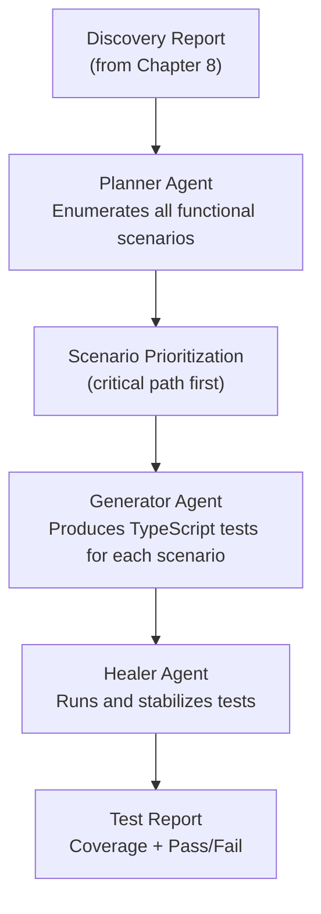

import Callout from '@site/src/components/Callout';
import TerminalPlayground from '@site/src/components/TerminalPlayground';

# Chapter 10: Autonomous Functional Test Suite Generation

## What You Will Learn

You will learn to generate comprehensive functional test suites autonomously — covering happy paths, edge cases, error states, and boundary conditions — without writing tests manually. You will combine the discovery agent (Chapter 8) with the Playwright Agents (Chapter 7) to produce production-grade test coverage.

## Prerequisites

- Chapter 9: Generating Interactive Website Tutorials

---

## What Is Functional Testing?

Functional testing verifies that an application does what it's supposed to do. It tests:
- **Happy paths:** The normal user journey succeeds
- **Error paths:** Invalid input produces correct error messages
- **Edge cases:** Boundary values are handled correctly
- **State transitions:** The application moves correctly between states

Traditional functional testing requires a human to identify all these scenarios. Autonomous generation uses AI to enumerate them from the application itself.

---

## The Autonomous Functional Test Pipeline



---

## Step 1: Generate a Functional Test Plan

Use the Planner Agent with a discovery report as context:

```bash
npx playwright test --agent=planner \
  --goal="Using the attached discovery report, create a comprehensive functional test plan covering all identified features. For each form, cover: happy path, required field validation, invalid format, boundary values. For each navigation flow, cover: successful navigation, deep links, back navigation." \
  --context=discovery-report.md \
  --output=functional-test-plan.md
```

The Planner will produce a test plan structured like:

```markdown
# Functional Test Plan

## Login / Authentication (Priority: Critical)
### Happy Path
- Valid email + valid password → redirect to dashboard
### Error Paths
- Invalid password → "Invalid credentials" error
- Non-existent email → "Invalid credentials" error (not "Email not found" — security)
- Empty email → "Email is required" validation
- Empty password → "Password is required" validation
### Edge Cases
- SQL injection in email field → graceful error, no server crash
- Very long email (255+ chars) → handled without crash
- Whitespace-only password → treated as empty

## Product Search (Priority: High)
### Happy Path
- Search term with results → displays matching products
- Partial match → displays partial matches
### Error Paths
- No results → "No products found" message
- Search with special chars → no crash
### Edge Cases
- Empty search → all products or error message
- Very long search term (500+ chars) → graceful handling
```

<Callout type="qa">
**For QA Engineers:** Notice the Planner automatically includes security-relevant edge cases (SQL injection, error message wording that doesn't reveal system details). This is test engineering knowledge baked into the agent. You'd need a senior QA engineer to generate this quality of test plan manually.
</Callout>

---

## Step 2: Generate TypeScript Tests

```bash
npx playwright test --agent=generator \
  --plan=functional-test-plan.md \
  --url=https://staging.app.example.com \
  --output=tests/
```

The Generator produces separate test files per feature area:

```
tests/
  auth.spec.ts
  product-search.spec.ts
  checkout.spec.ts
  user-profile.spec.ts
  admin.spec.ts
```

### Example Generated Test: Login

```typescript
import { test, expect } from '@playwright/test';

test.describe('Login / Authentication', () => {
  test.beforeEach(async ({ page }) => {
    await page.goto('/login');
  });

  test('Happy path: valid credentials redirect to dashboard', async ({ page }) => {
    await page.getByLabel('Email').fill('valid@example.com');
    await page.getByLabel('Password').fill('ValidPassword1!');
    await page.getByRole('button', { name: 'Sign in' }).click();

    await expect(page).toHaveURL('/dashboard');
    await expect(page.getByRole('heading', { name: 'Dashboard' })).toBeVisible();
  });

  test('Invalid password shows generic error', async ({ page }) => {
    await page.getByLabel('Email').fill('valid@example.com');
    await page.getByLabel('Password').fill('wrongpassword');
    await page.getByRole('button', { name: 'Sign in' }).click();

    await expect(page.getByText('Invalid credentials')).toBeVisible();
    await expect(page).toHaveURL('/login');
    // Security: should NOT say "password incorrect" (reveals valid email)
    await expect(page.getByText('password incorrect')).not.toBeVisible();
  });

  test('Empty email shows required validation', async ({ page }) => {
    await page.getByLabel('Password').fill('SomePassword1!');
    await page.getByRole('button', { name: 'Sign in' }).click();

    await expect(page.getByText('Email is required')).toBeVisible();
  });

  test('SQL injection in email is handled gracefully', async ({ page }) => {
    await page.getByLabel('Email').fill("'; DROP TABLE users; --");
    await page.getByLabel('Password').fill('anypassword');
    await page.getByRole('button', { name: 'Sign in' }).click();

    // Should not crash — any error message is acceptable
    await expect(page.getByRole('button', { name: 'Sign in' })).toBeVisible();
    await expect(page).toHaveURL('/login');
  });
});
```

---

## Interactive Terminal Demo

<TerminalPlayground chapter="chapter-10-autonomous-functional-testing" />

---

## Step 3: Prioritize and Organize Tests

Not all tests are equally important. Use a priority system:

```typescript
// playwright.config.ts
import { defineConfig, devices } from '@playwright/test';

export default defineConfig({
  testDir: './tests',
  // Run critical tests first
  projects: [
    {
      name: 'critical',
      testMatch: ['**/auth.spec.ts', '**/checkout.spec.ts'],
      use: { ...devices['Desktop Chrome'] },
    },
    {
      name: 'standard',
      testMatch: ['**/product-search.spec.ts', '**/user-profile.spec.ts'],
      use: { ...devices['Desktop Chrome'] },
      dependencies: ['critical'],
    },
    {
      name: 'extended',
      testMatch: ['**/admin.spec.ts'],
      use: { ...devices['Desktop Chrome'] },
      dependencies: ['standard'],
    },
  ],
  reporter: [['html'], ['json', { outputFile: 'test-results.json' }]],
});
```

---

## Step 4: Measure and Improve Coverage

After generating tests, measure coverage by feature:

```typescript
// scripts/coverage-report.ts
import * as fs from 'fs';

interface TestResult {
  title: string;
  status: 'passed' | 'failed' | 'skipped';
  file: string;
}

function analyzeCoverage(resultsFile: string): void {
  const results: { tests: TestResult[] } = JSON.parse(
    fs.readFileSync(resultsFile, 'utf-8')
  );

  const byFeature = new Map<string, { total: number; passed: number }>();

  for (const test of results.tests) {
    const feature = test.file.replace('tests/', '').replace('.spec.ts', '');
    const current = byFeature.get(feature) ?? { total: 0, passed: 0 };
    byFeature.set(feature, {
      total: current.total + 1,
      passed: current.passed + (test.status === 'passed' ? 1 : 0),
    });
  }

  console.log('\n📊 Test Coverage by Feature\n');
  for (const [feature, stats] of byFeature.entries()) {
    const pct = Math.round((stats.passed / stats.total) * 100);
    const bar = '█'.repeat(Math.floor(pct / 5)) + '░'.repeat(20 - Math.floor(pct / 5));
    console.log(`${feature.padEnd(25)} ${bar} ${pct}% (${stats.passed}/${stats.total})`);
  }
}

analyzeCoverage('./test-results.json');
```

<Callout type="dev">
**For Developers:** Run this coverage script in CI and set a threshold: if any feature drops below 80% pass rate, fail the build. This gives you a meaningful quality gate that's tied to actual feature behavior, not just code coverage numbers.
</Callout>

---

## Try It Yourself

### Challenge 1: Test Plan Generation
Pick a web application with a login form. Write a Planner-style test plan manually: list 5 happy path scenarios, 5 error paths, and 3 edge cases. Compare what you came up with to what the Planner would generate.

### Challenge 2: Test Code Review
Take one of the generated test examples above. Identify: which locators are brittle (likely to break)? Which assertions are too loose (might pass when they shouldn't)?

### Challenge 3: Coverage Gap Analysis
Look at the feature inventory from Chapter 8's discovery exercise. For each feature, ask: does the generated test suite cover the happy path? The most common error path? List the gaps.

---

## Common Mistakes

**Mistake 1: Testing implementation details instead of behavior**
```typescript
// Bad — tests internal class name
await expect(page.locator('.btn-primary.submit-cta')).toBeVisible();

// Good — tests user-visible behavior
await expect(page.getByRole('button', { name: 'Complete Purchase' })).toBeVisible();
```

**Mistake 2: Not isolating test state**
Each test must be independent. Use `test.beforeEach` to navigate to the starting URL. Don't share state between tests.

**Mistake 3: Over-asserting on dynamic content**
If a page shows timestamps, user-specific IDs, or random data, assert on structure, not specific values:
```typescript
// Fragile — timestamp changes every test run
await expect(page.getByText('Order placed at 2:34 PM')).toBeVisible();

// Robust — structure is stable
await expect(page.getByText(/Order placed at/)).toBeVisible();
```

---

## Summary

- Discovery report → Planner Agent → comprehensive functional test plan
- Generator Agent converts the plan to TypeScript Playwright tests, verified against live app
- Healer Agent stabilizes the suite after initial generation
- Organize tests by priority: critical, standard, extended
- Measure coverage by feature area, not just pass/fail
- Each test should be independent, behavior-focused, and free of implementation detail

## Next Steps

Chapter 11 extends beyond functional testing to performance, UX, and visual testing — all through Playwright CLI.

**[→ Chapter 11: Performance, UX, and Visual Testing via Playwright CLI](./chapter-11-performance-ux-visual-testing)**
