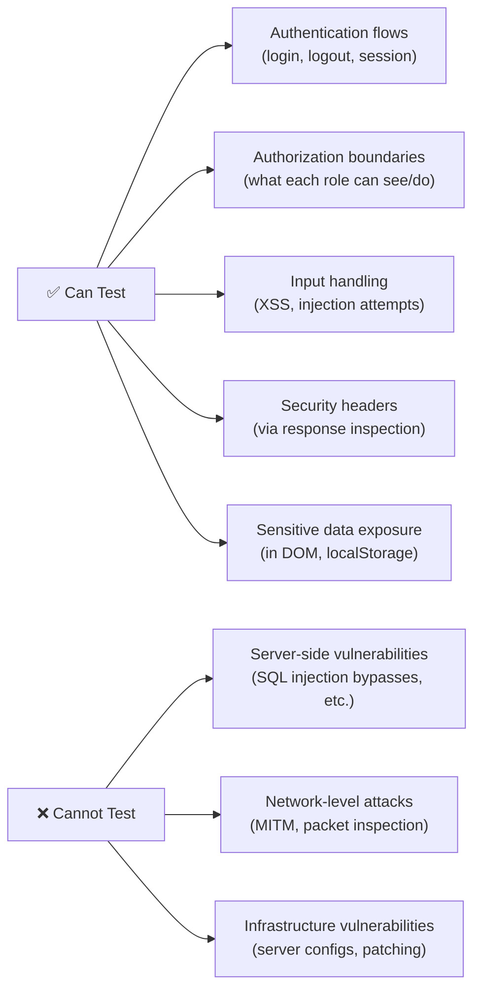

import Callout from '@site/src/components/Callout';
import TerminalPlayground from '@site/src/components/TerminalPlayground';

# Chapter 12: Security Testing Automation with Playwright CLI

## What You Will Learn

You will learn to automate detection of common web security vulnerabilities using Playwright CLI and Playwright tests. You will test authentication security, input validation, permission boundaries, and security headers. By the end, you'll have a security test suite that catches common vulnerabilities before production.

## Prerequisites

- Chapter 11: Performance, UX, and Visual Testing

:::warning
**Important:** Only test applications you own or have explicit written permission to test. Unauthorized security testing is illegal in most jurisdictions. All examples in this chapter use your own staging/dev environments.
:::

---

## What Playwright CLI Can and Cannot Test

Playwright is a browser automation tool — it can test security from the **client perspective**:



---

## Authentication Security Tests

### Session Management

```typescript
import { test, expect } from '@playwright/test';

test.describe('Session Security', () => {
  test('Logout invalidates session token', async ({ page, context }) => {
    // Log in
    await page.goto('/login');
    await page.getByLabel('Email').fill('user@example.com');
    await page.getByLabel('Password').fill('ValidPass1!');
    await page.getByRole('button', { name: 'Sign in' }).click();
    await expect(page).toHaveURL('/dashboard');

    // Capture session cookie
    const cookies = await context.cookies();
    const sessionCookie = cookies.find(c => c.name === 'session_token');
    expect(sessionCookie).toBeDefined();

    // Log out
    await page.getByRole('button', { name: 'Log out' }).click();
    await expect(page).toHaveURL('/login');

    // Attempt to use old session cookie after logout
    await context.addCookies([sessionCookie!]);
    await page.goto('/dashboard');

    // Should redirect to login — old session is invalid
    await expect(page).toHaveURL('/login');
  });

  test('Session cookie has security flags', async ({ page, context }) => {
    await page.goto('/login');
    await page.getByLabel('Email').fill('user@example.com');
    await page.getByLabel('Password').fill('ValidPass1!');
    await page.getByRole('button', { name: 'Sign in' }).click();

    const cookies = await context.cookies();
    const sessionCookie = cookies.find(c => c.name === 'session_token');

    expect(sessionCookie?.httpOnly).toBe(true);   // Not readable by JS
    expect(sessionCookie?.secure).toBe(true);      // HTTPS only
    expect(sessionCookie?.sameSite).toBe('Lax');   // CSRF protection
  });
});
```

---

## Authorization Boundary Tests

```typescript
test.describe('Authorization Boundaries', () => {
  test('Regular user cannot access admin panel', async ({ page }) => {
    // Log in as regular user
    await page.goto('/login');
    await page.getByLabel('Email').fill('user@example.com');
    await page.getByLabel('Password').fill('UserPass1!');
    await page.getByRole('button', { name: 'Sign in' }).click();

    // Attempt direct navigation to admin area
    await page.goto('/admin/users');

    // Should redirect or show access denied
    const url = page.url();
    const isAccessDenied =
      url.includes('/login') ||
      url.includes('/access-denied') ||
      url.includes('/403');

    expect(isAccessDenied).toBe(true);
  });

  test('User A cannot view User B\'s data', async ({ browser }) => {
    // Session for User A
    const contextA = await browser.newContext();
    const pageA = await contextA.newPage();
    await pageA.goto('/login');
    await pageA.getByLabel('Email').fill('userA@example.com');
    await pageA.getByLabel('Password').fill('UserAPass1!');
    await pageA.getByRole('button', { name: 'Sign in' }).click();

    // Get User A's profile URL
    const userAUrl = pageA.url();
    const userAId = userAUrl.match(/\/profile\/(\d+)/)?.[1];

    // Session for User B
    const contextB = await browser.newContext();
    const pageB = await contextB.newPage();
    await pageB.goto('/login');
    await pageB.getByLabel('Email').fill('userB@example.com');
    await pageB.getByLabel('Password').fill('UserBPass1!');
    await pageB.getByRole('button', { name: 'Sign in' }).click();

    // User B attempts to access User A's profile directly
    if (userAId) {
      await pageB.goto(`/profile/${userAId}`);
      // Should redirect, show "not found", or show limited public data
      await expect(pageB.getByText(/private|not found|access denied/i)).toBeVisible();
    }

    await contextA.close();
    await contextB.close();
  });
});
```

<Callout type="qa">
**For QA Engineers:** Authorization tests are often overlooked in standard functional testing but are critical for security. The pattern of "log in as a lower-privilege user, attempt to access higher-privilege resources directly" catches IDOR (Insecure Direct Object Reference) vulnerabilities — one of the most common web security flaws.
</Callout>

---

## Input Validation and XSS Detection

```typescript
test.describe('Input Security', () => {
  const xssPayloads = [
    '<script>window._xss=1</script>',
    '',
    'javascript:window._xss=1',
    '"><script>window._xss=1</script>',
  ];

  for (const payload of xssPayloads) {
    test(`XSS payload does not execute: ${payload.slice(0, 30)}`, async ({ page }) => {
      await page.goto('/profile/edit');

      // Inject payload into a user-controlled text field
      await page.getByLabel('Display name').fill(payload);
      await page.getByRole('button', { name: 'Save' }).click();

      // Navigate to where the input is displayed
      await page.goto('/profile');

      // Check that the script did not execute
      const xssExecuted = await page.evaluate(() => !!(window as any)._xss);
      expect(xssExecuted).toBe(false);
    });
  }

  test('HTML entities are escaped in output', async ({ page }) => {
    await page.goto('/profile/edit');
    await page.getByLabel('Display name').fill('<b>Bold Name</b>');
    await page.getByRole('button', { name: 'Save' }).click();

    await page.goto('/profile');

    // The text should appear as literal characters, not bold
    const nameText = await page.getByTestId('display-name').textContent();
    expect(nameText).toContain('<b>Bold Name</b>'); // HTML shown as text
    // NOT: bold formatting applied
  });
});
```

---

## Security Header Verification

```typescript
test.describe('Security Headers', () => {
  test('Critical security headers are present', async ({ page }) => {
    const response = await page.goto('https://app.example.com');
    const headers = response?.headers() ?? {};

    // Content Security Policy
    expect(headers['content-security-policy']).toBeDefined();

    // Prevent MIME sniffing
    expect(headers['x-content-type-options']).toBe('nosniff');

    // Prevent clickjacking
    expect(
      headers['x-frame-options'] === 'DENY' ||
      headers['x-frame-options'] === 'SAMEORIGIN' ||
      headers['content-security-policy']?.includes('frame-ancestors')
    ).toBe(true);

    // HTTPS enforcement
    expect(headers['strict-transport-security']).toBeDefined();
  });

  test('Sensitive pages set no-cache headers', async ({ page }) => {
    await page.goto('/login');
    await page.getByLabel('Email').fill('user@example.com');
    await page.getByLabel('Password').fill('ValidPass1!');
    await page.getByRole('button', { name: 'Sign in' }).click();

    const response = await page.goto('/account/payment-methods');
    const cacheControl = response?.headers()['cache-control'] ?? '';

    // Payment pages must not be cached
    expect(cacheControl).toMatch(/no-store|no-cache/);
  });
});
```

---

## Sensitive Data Exposure Checks

```typescript
test.describe('Sensitive Data Exposure', () => {
  test('Passwords not stored in localStorage', async ({ page }) => {
    await page.goto('/login');
    await page.getByLabel('Email').fill('user@example.com');
    await page.getByLabel('Password').fill('ValidPass1!');
    await page.getByRole('button', { name: 'Sign in' }).click();

    const localStorageData = await page.evaluate(() => {
      const data: Record<string, string> = {};
      for (let i = 0; i < localStorage.length; i++) {
        const key = localStorage.key(i)!;
        data[key] = localStorage.getItem(key)!;
      }
      return data;
    });

    const values = Object.values(localStorageData).join(' ').toLowerCase();
    expect(values).not.toContain('validpass1!');
    expect(values).not.toContain('password');
  });

  test('Credit card numbers not in page source', async ({ page }) => {
    await page.goto('/checkout');
    // Fill a test card number
    await page.getByLabel('Card number').fill('4242424242424242');
    await page.getByRole('button', { name: 'Place Order' }).click();

    // On confirmation page, card number should be masked
    const pageContent = await page.content();
    expect(pageContent).not.toContain('4242424242424242');
  });
});
```

<TerminalPlayground chapter="chapter-12-security-testing-automation" />

---

## Try It Yourself

### Challenge 1: Session Cookie Audit
On your own local application, log in and inspect the session cookie using `playwright-cli eval "document.cookie"`. Does it show the session token? (It should NOT — HttpOnly cookies are invisible to JavaScript.)

### Challenge 2: Authorization Test
If your application has multiple user roles, write a test that logs in as the lowest-privilege role and attempts to navigate directly to URLs that require higher privileges. Document what happens.

### Challenge 3: XSS Self-Check
On a staging environment you control, try submitting `<script>alert('xss')</script>` in a text field. Does the alert fire when viewing the submitted data? This is a basic XSS check.

---

## Common Mistakes

**Mistake 1: Testing against production**
Always use staging/dev environments for security tests. Automated security tests can trigger rate limiting, account lockouts, or WAF blocks on production.

**Mistake 2: Concluding "no XSS" from one payload**
No XSS payload list is exhaustive. Automated tests catch the most common patterns. Add new payloads as you discover bypass techniques, and supplement with manual code review.

**Mistake 3: Ignoring `httpOnly` cookies**
If `document.cookie` returns your session token, the app is vulnerable to cookie theft via XSS. `httpOnly` cookies don't appear in `document.cookie`.

---

## Summary

- Playwright security tests cover: session management, authorization, input validation/XSS, security headers, sensitive data exposure
- Test after logout: old session tokens must be invalid
- Authorization tests: lower-privilege users must not access higher-privilege resources
- XSS tests: verify payloads don't execute + HTML is entity-encoded in output
- Security headers: CSP, X-Content-Type-Options, X-Frame-Options, HSTS
- Never test against production; use only authorized staging/dev environments

## Next Steps

Chapter 13 covers CI/CD integration — building the pipeline that runs all your tests (functional, performance, UX, security) automatically on every commit.

**[→ Chapter 13: CI/CD Integration: Building Agentic Testing Pipelines](./chapter-13-cicd-agentic-pipelines)**
