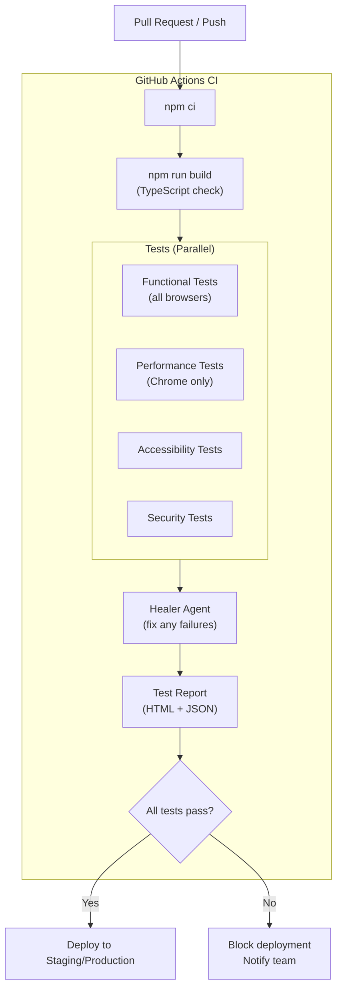

import Callout from '@site/src/components/Callout';
import CodePlayground from '@site/src/components/CodePlayground';

# Chapter 13: CI/CD Integration: Building Agentic Testing Pipelines

## What You Will Learn

You will build a complete GitHub Actions CI/CD pipeline that runs all test types (functional, performance, accessibility, security) automatically on every pull request and deployment. You will also learn to integrate the Playwright Agents into the pipeline for autonomous test healing. By the end, you'll have a production-grade agentic testing pipeline.

## Prerequisites

- Chapter 12: Security Testing Automation

---

## The Full Pipeline Architecture



---

## Base GitHub Actions Workflow

```yaml
# .github/workflows/test.yml
name: Playwright Tests

on:
  push:
    branches: [main, develop]
  pull_request:
    branches: [main]

env:
  NODE_VERSION: '20'

jobs:
  install:
    runs-on: ubuntu-latest
    steps:
      - uses: actions/checkout@v4
      - uses: actions/setup-node@v4
        with:
          node-version: ${{ env.NODE_VERSION }}
          cache: 'npm'
      - name: Install dependencies
        run: npm ci
      - name: Install Playwright browsers
        run: npx playwright install --with-deps chromium firefox webkit
      - name: Cache Playwright browsers
        uses: actions/cache@v4
        with:
          path: ~/.cache/ms-playwright
          key: playwright-${{ runner.os }}-${{ hashFiles('package-lock.json') }}

  build:
    needs: install
    runs-on: ubuntu-latest
    steps:
      - uses: actions/checkout@v4
      - uses: actions/setup-node@v4
        with:
          node-version: ${{ env.NODE_VERSION }}
          cache: 'npm'
      - run: npm ci
      - name: TypeScript check
        run: npx tsc --noEmit
      - name: Build application
        run: npm run build

  functional-tests:
    needs: build
    runs-on: ubuntu-latest
    strategy:
      matrix:
        browser: [chromium, firefox, webkit]
      fail-fast: false
    steps:
      - uses: actions/checkout@v4
      - uses: actions/setup-node@v4
        with:
          node-version: ${{ env.NODE_VERSION }}
          cache: 'npm'
      - run: npm ci
      - run: npx playwright install --with-deps ${{ matrix.browser }}
      - name: Run functional tests
        run: npx playwright test tests/functional/ --project=${{ matrix.browser }}
      - uses: actions/upload-artifact@v4
        if: always()
        with:
          name: playwright-report-functional-${{ matrix.browser }}
          path: playwright-report/

  performance-tests:
    needs: build
    runs-on: ubuntu-latest
    steps:
      - uses: actions/checkout@v4
      - uses: actions/setup-node@v4
        with: { node-version: '${{ env.NODE_VERSION }}', cache: 'npm' }
      - run: npm ci && npx playwright install --with-deps chromium
      - name: Run performance tests
        run: npx playwright test tests/performance/ --project=chromium
      - uses: actions/upload-artifact@v4
        if: always()
        with:
          name: playwright-report-performance
          path: playwright-report/

  accessibility-tests:
    needs: build
    runs-on: ubuntu-latest
    steps:
      - uses: actions/checkout@v4
      - uses: actions/setup-node@v4
        with: { node-version: '${{ env.NODE_VERSION }}', cache: 'npm' }
      - run: npm ci && npx playwright install --with-deps chromium
      - name: Run accessibility tests
        run: npx playwright test tests/accessibility/ --project=chromium
      - uses: actions/upload-artifact@v4
        if: always()
        with:
          name: playwright-report-accessibility
          path: playwright-report/

  security-tests:
    needs: build
    runs-on: ubuntu-latest
    steps:
      - uses: actions/checkout@v4
      - uses: actions/setup-node@v4
        with: { node-version: '${{ env.NODE_VERSION }}', cache: 'npm' }
      - run: npm ci && npx playwright install --with-deps chromium
      - name: Run security tests
        run: npx playwright test tests/security/ --project=chromium
      - uses: actions/upload-artifact@v4
        if: always()
        with:
          name: playwright-report-security
          path: playwright-report/

  healer:
    needs: [functional-tests, performance-tests, accessibility-tests, security-tests]
    runs-on: ubuntu-latest
    if: failure()  # Only run if any test job failed
    steps:
      - uses: actions/checkout@v4
      - uses: actions/setup-node@v4
        with: { node-version: '${{ env.NODE_VERSION }}', cache: 'npm' }
      - run: npm ci && npx playwright install --with-deps chromium
      - name: Run Healer Agent
        run: npx playwright test --agent=healer tests/
      - name: Commit healed tests
        uses: stefanzweifel/git-auto-commit-action@v5
        with:
          commit_message: 'chore: auto-heal Playwright tests [skip ci]'
          file_pattern: 'tests/*.spec.ts'

  deploy:
    needs: [functional-tests, performance-tests, accessibility-tests, security-tests]
    runs-on: ubuntu-latest
    if: success() && github.ref == 'refs/heads/main'
    steps:
      - uses: actions/checkout@v4
      - uses: actions/setup-node@v4
        with: { node-version: '${{ env.NODE_VERSION }}', cache: 'npm' }
      - run: npm ci && npm run build
      - name: Deploy to GitHub Pages
        uses: peaceiris/actions-gh-pages@v4
        with:
          github_token: ${{ secrets.GITHUB_TOKEN }}
          publish_dir: ./build
```

---

## Playwright Config for CI

```typescript
// playwright.config.ts
import { defineConfig, devices } from '@playwright/test';

const isCI = !!process.env.CI;
const baseURL = process.env.BASE_URL ?? 'http://localhost:3000';

export default defineConfig({
  testDir: './tests',
  fullyParallel: true,
  forbidOnly: isCI,
  retries: isCI ? 2 : 0,   // Retry flaky tests in CI
  workers: isCI ? 4 : undefined,
  timeout: 30000,
  reporter: [
    ['html', { outputFolder: 'playwright-report' }],
    ['json', { outputFile: 'test-results.json' }],
    isCI ? ['github'] : ['list'],  // GitHub annotations in CI
  ],
  use: {
    baseURL,
    screenshot: 'only-on-failure',
    video: isCI ? 'retain-on-failure' : 'off',
    trace: isCI ? 'retain-on-failure' : 'off',
  },
  projects: [
    { name: 'chromium', use: { ...devices['Desktop Chrome'] } },
    { name: 'firefox', use: { ...devices['Desktop Firefox'] } },
    { name: 'webkit', use: { ...devices['Desktop Safari'] } },
    { name: 'mobile', use: { ...devices['iPhone 14'] } },
  ],
  webServer: isCI ? undefined : {
    command: 'npm run start',
    url: baseURL,
    reuseExistingServer: true,
  },
});
```

---

## Interactive Configuration Demo

<CodePlayground chapter="chapter-13-cicd-agentic-pipelines" />

---

## PR Quality Gate with Test Summary

Add a comment to every PR with the test summary:

```yaml
  pr-comment:
    needs: [functional-tests, performance-tests, accessibility-tests]
    runs-on: ubuntu-latest
    if: github.event_name == 'pull_request'
    permissions:
      pull-requests: write
    steps:
      - name: Download all reports
        uses: actions/download-artifact@v4
        with:
          path: all-reports/
      - name: Post test summary
        uses: actions/github-script@v7
        with:
          script: |
            const fs = require('fs');
            const results = JSON.parse(fs.readFileSync('all-reports/playwright-report-functional-chromium/test-results.json', 'utf8'));
            const { total, passed, failed } = results.stats;
            const emoji = failed === 0 ? '✅' : '❌';
            await github.rest.issues.createComment({
              owner: context.repo.owner,
              repo: context.repo.repo,
              issue_number: context.issue.number,
              body: `## ${emoji} Playwright Test Results\n\n| | Count |\n|---|---|\n| Total | ${total} |\n| ✅ Passed | ${passed} |\n| ❌ Failed | ${failed} |\n\n${failed > 0 ? '**Action required:** Fix failing tests before merging.' : 'All tests passing — ready to merge.'}`
            });
```

<Callout type="dev">
**For Developers:** The PR comment gives reviewers instant visibility into test status without needing to click into CI logs. Failed tests block merges. Passing tests give confidence to approve. This is the core of "shift-left" testing — catching issues at PR time, not post-deployment.
</Callout>

<Callout type="ai">
**For AI Engineers:** The Healer Agent running in CI is key. When a test fails due to a UI change (not a real bug), the Healer fixes it and commits the fix automatically, keeping the pipeline green without human intervention. Only real application bugs should block the pipeline.
</Callout>

---

## Scheduling: Nightly Discovery and Coverage Refresh

```yaml
# .github/workflows/nightly.yml
name: Nightly Discovery and Coverage Refresh

on:
  schedule:
    - cron: '0 2 * * *'  # 2 AM UTC nightly

jobs:
  discover-and-refresh:
    runs-on: ubuntu-latest
    steps:
      - uses: actions/checkout@v4
      - uses: actions/setup-node@v4
        with: { node-version: '20', cache: 'npm' }
      - run: npm ci && npx playwright install --with-deps chromium
      - name: Install playwright-cli
        run: npm install -g @playwright/cli
      - name: Run discovery agent
        run: npx ts-node scripts/discover.ts
        env:
          TARGET_URL: ${{ vars.STAGING_URL }}
      - name: Refresh test plan
        run: npx playwright test --agent=planner --context=discovery-report.md --output=test-plan.md
      - name: Generate new tests
        run: npx playwright test --agent=generator --plan=test-plan.md --output=tests/generated/
      - name: Commit updated tests
        uses: stefanzweifel/git-auto-commit-action@v5
        with:
          commit_message: 'chore: nightly test coverage refresh [skip ci]'
          file_pattern: 'tests/generated/*.spec.ts test-plan.md discovery-report.md'
```

---

## Try It Yourself

### Challenge 1: Local Pipeline Simulation
Run your tests locally as CI would: `npx playwright test --reporter=html --forbid-only`. Open the HTML report. Are there any failures?

### Challenge 2: Failing Test CI Behavior
Intentionally break one test (change an expected string). Push to a branch. Watch the CI workflow run and fail. Observe how the Healer job triggers.

### Challenge 3: Performance Gate
Add a performance gate to your CI config: if any page's LCP exceeds 3 seconds, block deployment. Write the GitHub Actions step that reads from `test-results.json` and fails if the threshold is exceeded.

---

## Common Mistakes

**Mistake 1: Running all tests sequentially in CI**
Playwright tests in CI should run in parallel across browsers. Set `workers: 4` and `fullyParallel: true`. Sequential runs can take 20–30 minutes; parallel runs take 3–5 minutes.

**Mistake 2: Not caching Playwright browser binaries**
Playwright browser downloads (250–500MB) add 2–3 minutes to every CI run. Cache them:
```yaml
- uses: actions/cache@v4
  with:
    path: ~/.cache/ms-playwright
    key: playwright-${{ runner.os }}-${{ hashFiles('package-lock.json') }}
```

**Mistake 3: Setting retries too high**
```typescript
retries: isCI ? 5 : 0,  // Bad — masks real flakiness
retries: isCI ? 2 : 0,  // Good — catches transient issues
```
High retries hide flaky tests instead of fixing them.

---

## Summary

- Pipeline: install → build (TypeScript check) → parallel tests → Healer → deploy
- Run functional tests across all three browsers; perf/a11y/security on Chromium only
- Use `retries: 2` in CI, `forbidOnly: true`, and `fullyParallel: true`
- Cache Playwright browser binaries to save 2–3 minutes per run
- Healer Agent auto-fixes failing tests due to UI changes — only real bugs block
- PR comments with test summaries keep reviewers informed
- Nightly discovery + coverage refresh keeps tests current as the app evolves

## Next Steps

The final chapter brings everything together: a complete, production-ready autonomous QA system built from scratch.

**[→ Chapter 14: Capstone: Building a Fully Autonomous QA System](./chapter-14-capstone-autonomous-qa-system)**
