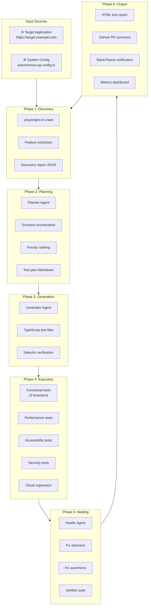

import Callout from '@site/src/components/Callout';
import CodePlayground from '@site/src/components/CodePlayground';
import TerminalPlayground from '@site/src/components/TerminalPlayground';

# Chapter 14: Capstone — Building a Fully Autonomous QA System

## What You Will Learn

You will build a complete, production-ready autonomous QA system that:
1. **Discovers** a target application's features automatically
2. **Plans** comprehensive test coverage using the Planner Agent
3. **Generates** executable TypeScript tests using the Generator Agent
4. **Runs** all tests including functional, performance, accessibility, and security
5. **Heals** test failures automatically using the Healer Agent
6. **Reports** results to GitHub and deploys the book
7. **Repeats** nightly to stay current as the application evolves

This is the full integration of every chapter in this book.

## Prerequisites

- All previous chapters (this chapter assumes complete understanding of all concepts)

---

## System Architecture



---

## Project Structure

```
autonomous-qa-system/
  autonomous-qa.config.ts      ← System configuration
  scripts/
    discover.ts                ← Phase 1: Discovery
    plan.ts                    ← Phase 2: Planning
    generate.ts                ← Phase 3: Generation
    heal.ts                    ← Phase 5: Healing
    report.ts                  ← Phase 6: Reporting
    run-pipeline.ts            ← Orchestrator
  tests/
    generated/                 ← Auto-generated tests
      functional/
      performance/
      accessibility/
      security/
    visual-baselines/          ← Screenshot baselines
  reports/
    discovery-report.json
    test-plan.md
    latest-run.json
  .github/
    workflows/
      autonomous-qa.yml
```

---

## Phase 1: System Configuration

```typescript
// autonomous-qa.config.ts
export interface AutonomousQAConfig {
  targetUrl: string;
  maxPagesToDiscover: number;
  testPriorities: ('functional' | 'performance' | 'accessibility' | 'security' | 'visual')[];
  performanceThresholds: {
    lcp: number;     // ms
    cls: number;     // score
    ttfb: number;    // ms
  };
  browsers: ('chromium' | 'firefox' | 'webkit')[];
  notifications: {
    slack?: { webhookUrl: string };
    github?: { createPRComment: boolean };
  };
  schedule: {
    fullRun: string;     // cron expression
    healingRun: string;  // cron expression
  };
}

const config: AutonomousQAConfig = {
  targetUrl: 'https://your-app.example.com',
  maxPagesToDiscover: 30,
  testPriorities: ['functional', 'accessibility', 'performance', 'security', 'visual'],
  performanceThresholds: {
    lcp: 2500,
    cls: 0.1,
    ttfb: 200,
  },
  browsers: ['chromium', 'firefox', 'webkit'],
  notifications: {
    github: { createPRComment: true },
  },
  schedule: {
    fullRun: '0 2 * * *',     // 2 AM nightly
    healingRun: '0 */6 * * *', // Every 6 hours
  },
};

export default config;
```

---

## Phase 2: The Discovery Script

```typescript
// scripts/discover.ts
import { execSync } from 'child_process';
import * as fs from 'fs';
import * as yaml from 'js-yaml';
import config from '../autonomous-qa.config';

interface DiscoveredPage {
  url: string;
  title: string;
  features: string[];
  forms: number;
  buttons: number;
}

function cli(cmd: string): string {
  return execSync(`playwright-cli -s=discovery ${cmd}`, {
    encoding: 'utf-8', timeout: 30000,
  }).trim();
}

async function discover(): Promise<void> {
  console.log(`🔍 Starting discovery: ${config.targetUrl}`);

  cli(`goto ${config.targetUrl}`);
  const homeSnapshot = cli('snapshot');
  const homeParsed = yaml.load(homeSnapshot) as any[];

  // Extract navigation links
  const navLinks: string[] = [];
  const traverse = (nodes: any[]) => {
    for (const n of nodes) {
      if (n.role === 'link' && n.name) navLinks.push(n.name);
      if (n.children) traverse(n.children);
    }
  };
  if (Array.isArray(homeParsed)) traverse(homeParsed);

  console.log(`Found ${navLinks.length} navigation links`);

  const pages: DiscoveredPage[] = [];
  const homeTitle = cli('eval "document.title"');
  pages.push({ url: config.targetUrl, title: homeTitle, features: navLinks.slice(0, 10), forms: 0, buttons: 0 });

  // Visit each linked page
  for (const link of navLinks.slice(0, config.maxPagesToDiscover - 1)) {
    try {
      const currentUrl = cli('eval "window.location.href"');
      cli(`click [name="${link}"]`);
      const newUrl = cli('eval "window.location.href"');

      if (newUrl !== currentUrl && newUrl.includes(new URL(config.targetUrl).hostname)) {
        const title = cli('eval "document.title"');
        const snap = cli('snapshot');
        const nodes = yaml.load(snap) as any[];
        const buttons: string[] = [];
        const forms: string[] = [];
        if (Array.isArray(nodes)) {
          const extract = (n: any[]) => n.forEach(node => {
            if (node.role === 'button') buttons.push(node.name ?? '');
            if (node.role === 'textbox') forms.push(node.name ?? '');
            if (node.children) extract(node.children);
          });
          extract(nodes);
        }
        pages.push({ url: newUrl, title, features: buttons.slice(0, 5), forms: forms.length, buttons: buttons.length });
        cli('go-back');
      }
    } catch { /* skip problematic pages */ }
  }

  const report = { targetUrl: config.targetUrl, discoveredAt: new Date().toISOString(), pages };
  fs.writeFileSync('reports/discovery-report.json', JSON.stringify(report, null, 2));
  console.log(`✅ Discovery complete. ${pages.length} pages found. Saved to reports/discovery-report.json`);
}

discover();
```

---

## Phase 3: The Orchestrator

```typescript
// scripts/run-pipeline.ts
import { execSync } from 'child_process';
import * as fs from 'fs';

function run(cmd: string, label: string): void {
  console.log(`\n▶ ${label}`);
  try {
    execSync(cmd, { stdio: 'inherit' });
    console.log(`✅ ${label} completed`);
  } catch (error) {
    console.error(`❌ ${label} failed`);
    throw error;
  }
}

async function runPipeline(): Promise<void> {
  const startTime = Date.now();
  console.log('🚀 Starting Autonomous QA Pipeline\n');

  // Phase 1: Discovery
  run('npx ts-node scripts/discover.ts', 'Phase 1: Website Discovery');

  // Phase 2: Test Planning
  run(
    'npx playwright test --agent=planner --context=reports/discovery-report.json --output=reports/test-plan.md',
    'Phase 2: Test Plan Generation'
  );

  // Phase 3: Test Generation
  run(
    'npx playwright test --agent=generator --plan=reports/test-plan.md --output=tests/generated/',
    'Phase 3: Test Generation'
  );

  // Phase 4: Execute all test types in parallel (done by CI, or sequentially locally)
  run('npx playwright test tests/generated/functional/ --reporter=json,html', 'Phase 4a: Functional Tests');
  run('npx playwright test tests/generated/performance/ --reporter=json', 'Phase 4b: Performance Tests');
  run('npx playwright test tests/generated/accessibility/ --reporter=json', 'Phase 4c: Accessibility Tests');
  run('npx playwright test tests/generated/security/ --reporter=json', 'Phase 4d: Security Tests');

  // Phase 5: Healing (if any tests failed)
  const results = JSON.parse(fs.readFileSync('test-results.json', 'utf-8'));
  if (results.stats?.failed > 0) {
    console.log(`\n🔧 ${results.stats.failed} tests failed — running Healer Agent`);
    run('npx playwright test --agent=healer tests/generated/', 'Phase 5: Healing');
  }

  const elapsed = ((Date.now() - startTime) / 1000).toFixed(1);
  console.log(`\n✅ Autonomous QA Pipeline complete in ${elapsed}s`);
  console.log(`📊 Report: file://$(pwd)/playwright-report/index.html`);
}

runPipeline().catch(process.exit);
```

---

## The Full GitHub Actions Workflow

```yaml
# .github/workflows/autonomous-qa.yml
name: Autonomous QA Pipeline

on:
  push:
    branches: [main]
  pull_request:
    branches: [main]
  schedule:
    - cron: '0 2 * * *'

jobs:
  autonomous-qa:
    runs-on: ubuntu-latest
    steps:
      - uses: actions/checkout@v4

      - uses: actions/setup-node@v4
        with: { node-version: '20', cache: 'npm' }

      - run: npm ci

      - name: Install Playwright browsers
        run: npx playwright install --with-deps chromium firefox webkit

      - name: Install Playwright CLI
        run: npm install -g @playwright/cli

      - name: Phase 1 — Discovery
        run: npx ts-node scripts/discover.ts
        env:
          TARGET_URL: ${{ vars.TARGET_URL }}

      - name: Phase 2 — Planning
        run: npx playwright test --agent=planner --context=reports/discovery-report.json --output=reports/test-plan.md

      - name: Phase 3 — Generation
        run: npx playwright test --agent=generator --plan=reports/test-plan.md --output=tests/generated/

      - name: Phase 4 — Execute All Tests
        run: npx playwright test tests/generated/ --reporter=html,json
        continue-on-error: true

      - name: Phase 5 — Heal Failures
        if: failure()
        run: npx playwright test --agent=healer tests/generated/

      - name: Upload Test Report
        uses: actions/upload-artifact@v4
        if: always()
        with:
          name: autonomous-qa-report
          path: playwright-report/
          retention-days: 30

      - name: Post PR Comment
        if: github.event_name == 'pull_request'
        uses: actions/github-script@v7
        with:
          script: |
            const fs = require('fs');
            const r = JSON.parse(fs.readFileSync('test-results.json', 'utf8'));
            const { passed, failed, total } = r.stats;
            await github.rest.issues.createComment({
              ...context.repo,
              issue_number: context.issue.number,
              body: `## 🤖 Autonomous QA Report\n\n| Tests | Count |\n|---|---|\n| Total | ${total} |\n| ✅ Passed | ${passed} |\n| ❌ Failed | ${failed} |\n\n${failed === 0 ? '**All tests passing.**' : `**${failed} failures detected. Healer Agent applied fixes.**`}`
            });

      - name: Deploy Book to GitHub Pages
        if: success() && github.ref == 'refs/heads/main'
        uses: peaceiris/actions-gh-pages@v4
        with:
          github_token: ${{ secrets.GITHUB_TOKEN }}
          publish_dir: ./build
```

---

## Interactive Demo

<CodePlayground chapter="chapter-14-capstone-autonomous-qa-system" />
<TerminalPlayground chapter="chapter-14-capstone-autonomous-qa-system" />

---

## What You've Built

Congratulations. Your autonomous QA system:

| Capability | Implementation |
|---|---|
| Website discovery | `playwright-cli` + snapshot YAML parsing |
| Test plan generation | Playwright Planner Agent |
| Test code generation | Playwright Generator Agent |
| Functional testing | TypeScript Playwright tests, 3 browsers |
| Performance testing | Core Web Vitals via PerformanceObserver |
| Accessibility testing | `@axe-core/playwright` WCAG 2.1 AA |
| Security testing | Session, authorization, XSS, headers |
| Visual regression | `toHaveScreenshot()` baselines |
| Self-healing | Playwright Healer Agent |
| CI/CD | GitHub Actions (4–7 min runtime) |
| Reporting | HTML report + PR comment |
| Scheduling | Nightly full run + 6-hour healing |

---

## Try It Yourself

### Final Challenge: Deploy Your Own System
1. Fork or clone this repository
2. Update `autonomous-qa.config.ts` with your application's URL
3. Set the `TARGET_URL` repository secret in GitHub
4. Push to `main`
5. Watch the Autonomous QA Pipeline run in GitHub Actions
6. Check the PR comment on your next pull request

### Stretch Goal
Extend the system with:
- **Slack notification** when new test failures are detected
- **Trend dashboard** tracking pass rates over time
- **Coverage badge** in README showing current test health

---

## What's Next?

You've completed the Playwright CLI: The Agentic Testing Handbook. You now have:

- Deep understanding of Playwright CLI's architecture and token efficiency
- Working integration with AI coding agents (Claude Code, Copilot, Cursor)
- Knowledge of all three Playwright Agents (Planner, Generator, Healer)
- Skills to build autonomous discovery, tutorial generation, and testing systems
- A production-ready CI/CD pipeline for continuous, autonomous quality assurance

The field of agentic testing is evolving rapidly. As Playwright CLI matures and new agents emerge, the patterns in this book will be your foundation. The key insight — **keep browser state external, give agents minimal actionable information** — will remain relevant regardless of what tools come next.

**Happy testing.**

---

*Playwright CLI: The Agentic Testing Handbook is an open-source interactive book. Contributions welcome at [github.com/arvind3/PlaywriteClikBookWithIDE](https://github.com/arvind3/PlaywriteClikBookWithIDE).*
